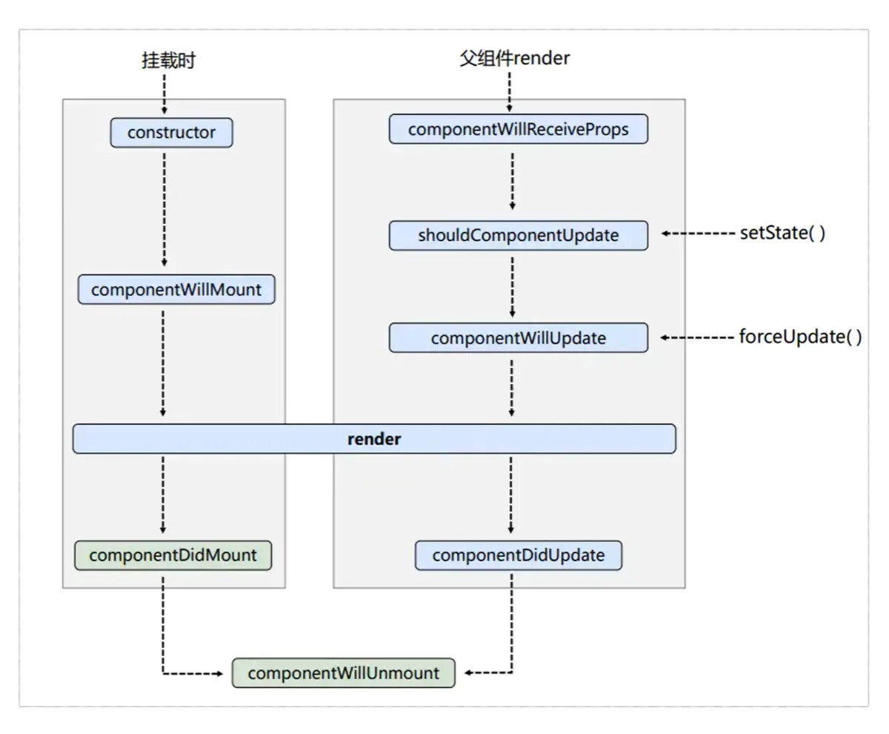
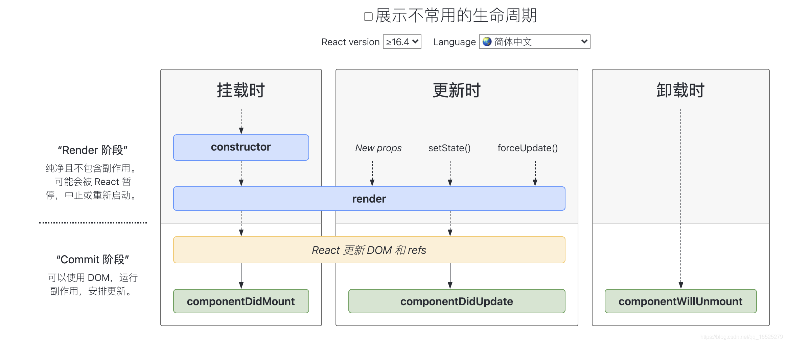

- [上海碳衡科技一面](#上海碳衡科技一面)
  - [1. 聊聊可视化的技术选型是怎么样的](#1-聊聊可视化的技术选型是怎么样的)
  - [2. 聊聊es8新特性有哪些](#2-聊聊es8新特性有哪些)
  - [3. 斐波那契数列有哪些实现方式](#3-斐波那契数列有哪些实现方式)
  - [4. 说说树与图有什么异同点](#4-说说树与图有什么异同点)
  - [5. 给你一棵公司节点的树，然后给你树中的一个用户id，让你返回一个该用户的父亲节点的数组信息，如何实现](#5-给你一棵公司节点的树然后给你树中的一个用户id让你返回一个该用户的父亲节点的数组信息如何实现)
  - [6. webpack的构建流程](#6-webpack的构建流程)
  - [6. Webpack的path和public path区别](#6-webpack的path和public-path区别)
  - [7. 聊聊如果有16个矩形，但是theme主题颜色只有10个，那么如何实现，给剩下6个颜色进行填充](#7-聊聊如果有16个矩形但是theme主题颜色只有10个那么如何实现给剩下6个颜色进行填充)
  - [8. 聊聊你知道的排序算法](#8-聊聊你知道的排序算法)
  - [9. 你知道react吗？聊聊react吧？react与vue的区别有哪些](#9-你知道react吗聊聊react吧react与vue的区别有哪些)
  - [10.  聊聊js如何实现私有变量？](#10--聊聊js如何实现私有变量)
  - [11.  谈谈你自己的规划吧？你对自己有什么计划？](#11--谈谈你自己的规划吧你对自己有什么计划)
- [上海碳衡科技二轮面试](#上海碳衡科技二轮面试)
  - [0.typescript解决了什么痛点呢？](#0typescript解决了什么痛点呢)
  - [1.聊聊vue的核心逻辑是什么？](#1聊聊vue的核心逻辑是什么)
  - [聊聊现实生活中的代理模式是什么样的](#聊聊现实生活中的代理模式是什么样的)
  - [聊聊正向代理反向代理是什么？](#聊聊正向代理反向代理是什么)
  - [2.介绍一下你的工作内容，以及遇到的问题，如何解决的](#2介绍一下你的工作内容以及遇到的问题如何解决的)
  - [3.公司主要的业务内容](#3公司主要的业务内容)
  - [雾角科技有限公司](#雾角科技有限公司)
  - [1.看一下这段代码是怎么输出的](#1看一下这段代码是怎么输出的)
  - [2.leetcode](#2leetcode)
  - [3.不使用Math函数实现开更号](#3不使用math函数实现开更号)
  - [4.聊聊useContext还有如何实现细粒度的数据更新](#4聊聊usecontext还有如何实现细粒度的数据更新)
  - [5.useEffect的逻辑聊聊把](#5useeffect的逻辑聊聊把)
  - [5.对于一个监听的对象useEffect，其对象上挂载的数据发生了变化，那么监听这个对象的组件会不会更新呢？](#5对于一个监听的对象useeffect其对象上挂载的数据发生了变化那么监听这个对象的组件会不会更新呢)
  - [5.知道mobx？吗](#5知道mobx吗)
  - [useCallback 记忆函数与useMemo 记忆组件](#usecallback-记忆函数与usememo-记忆组件)
  - [6.聊聊vue底层的数据绑定把。](#6聊聊vue底层的数据绑定把)
  - [7.autoRun知道吗？聊聊autoRun](#7autorun知道吗聊聊autorun)
  - [聊聊可视化有哪些库？能介绍一下吗](#聊聊可视化有哪些库能介绍一下吗)
  - [给你一个1个亿的数据绘制散点图，如何性能优化](#给你一个1个亿的数据绘制散点图如何性能优化)
  - [知道G2吗？ 了解图形语法吗？](#知道g2吗-了解图形语法吗)
  - [讲讲zrender，逐帧渲染如何实现的？](#讲讲zrender逐帧渲染如何实现的)
  - [璇星科技一面](#璇星科技一面)
    - [1.介绍一下你的项目以及你所遇到的挑战](#1介绍一下你的项目以及你所遇到的挑战)
    - [2.react了解的多吗？聊聊你对react的理解](#2react了解的多吗聊聊你对react的理解)
    - [3.介绍一下css中的flex布局把](#3介绍一下css中的flex布局把)
    - [4. 上下定高 中间自适应_上下高度固定（100px），中间自适应如何实现](#4-上下定高-中间自适应_上下高度固定100px中间自适应如何实现)
    - [5.typescript你熟悉吗？介绍一下？](#5typescript你熟悉吗介绍一下)
    - [6.typescript类型判断是什么？](#6typescript类型判断是什么)
    - [7.请问下面这个类型typescript如何定义](#7请问下面这个类型typescript如何定义)
    - [8.ts的any与never与unknown有什么不同？](#8ts的any与never与unknown有什么不同)
    - [8.聊聊自己的规划把](#8聊聊自己的规划把)
  - [抖音电商面试一轮](#抖音电商面试一轮)
    - [1.. 介绍一下你的项目把，聊聊你遇到的那些问题比较有意思，或者有挑战的事情](#1-介绍一下你的项目把聊聊你遇到的那些问题比较有意思或者有挑战的事情)
    - [2. typescript有什么优势，介绍一下](#2-typescript有什么优势介绍一下)
    - [3. 看得懂这个是什么吗？function identity<T,U>](#3-看得懂这个是什么吗function-identitytu)
    - [4. 跨域有哪些，介绍一下，捡几个深入聊聊](#4-跨域有哪些介绍一下捡几个深入聊聊)
    - [5. 知道css的var()吗？用来做什么的](#5-知道css的var吗用来做什么的)
    - [6. 了解flex吗？说说flex](#6-了解flex吗说说flex)
    - [7. flex:0 1 auto有什么用](#7-flex0-1-auto有什么用)
    - [8.  说说BFC？你怎么理解bfc](#8--说说bfc你怎么理解bfc)
    - [9.  说说那些方式可以触发bfc](#9--说说那些方式可以触发bfc)
    - [10.  前端换肤的N种方案，聊聊具体细节如何实现的](#10--前端换肤的n种方案聊聊具体细节如何实现的)
    - [11.  聊聊js的new关键字，new一个对象他的过程是什么](#11--聊聊js的new关键字new一个对象他的过程是什么)
    - [12. 了解es6到es5的语法转换怎么实现的，babel的打包逻辑是什么样的](#12-了解es6到es5的语法转换怎么实现的babel的打包逻辑是什么样的)
    - [14. 说说你了解的js类型有哪些？](#14-说说你了解的js类型有哪些)
    - [15. js的typeof返回那些数据类型](#15-js的typeof返回那些数据类型)
    - [16. typof（null）是什么，为什么](#16-typofnull是什么为什么)
    - [17. 说说0.1+0.2不等于0.3为什么，如何实现让其相等](#17-说说0102不等于03为什么如何实现让其相等)
    - [18. 说说如何不用math库实现开更号](#18-说说如何不用math库实现开更号)
    - [19. 说说promise.all手写一个](#19-说说promiseall手写一个)
  - [合合信息](#合合信息)
    - [1.介绍一下你自己然后介绍一下项目情况](#1介绍一下你自己然后介绍一下项目情况)
    - [1.有echarts,d3.js了为什么还要开发一个chartkit?](#1有echartsd3js了为什么还要开发一个chartkit)
    - [2.了解那些Es6语法](#2了解那些es6语法)
    - [3.如何中断promise](#3如何中断promise)
    - [4.for in 和for of 的区别](#4for-in-和for-of-的区别)
    - [5. 什么样的对象是不可以被for of 迭代的](#5-什么样的对象是不可以被for-of-迭代的)
    - [6. 如何把一个对象变为可迭代的对象](#6-如何把一个对象变为可迭代的对象)
    - [7.介绍一下vue的生命周期](#7介绍一下vue的生命周期)
    - [8.介绍一下rect与vue的diff算法有何不同，详细说说diff算法](#8介绍一下rect与vue的diff算法有何不同详细说说diff算法)
    - [9.聊聊这个函数的输出](#9聊聊这个函数的输出)
  - [10.如何中断Promise的链式调用](#10如何中断promise的链式调用)
  - [易有料一面](#易有料一面)
    - [2. 聊聊vue3.0的特点把？](#2-聊聊vue30的特点把)
  - [商涌科技](#商涌科技)
    - [1. 有一个父元素包含一个子元素，如何实现子元素的垂直居中](#1-有一个父元素包含一个子元素如何实现子元素的垂直居中)
    - [2. 说说flex布局的参数把](#2-说说flex布局的参数把)
    - [3. 聊聊interface与type有何区别](#3-聊聊interface与type有何区别)
    - [4. 说说ts的类型定义把？](#4-说说ts的类型定义把)
    - [5. vue写的ssr框架是什么，描述一下ssr把](#5-vue写的ssr框架是什么描述一下ssr把)
    - [6. 聊聊react的useeffect把](#6-聊聊react的useeffect把)
    - [7. 你知道useeffect和uselayout有啥区别](#7-你知道useeffect和uselayout有啥区别)
    - [8. 你知道react router如何传参的吗](#8-你知道react-router如何传参的吗)
  - [匠心科技](#匠心科技)
    - [2. chrome并发请求数](#2-chrome并发请求数)
    - [3. 在React中如何判断点击元素属于哪一个组件，如何判断是一个dom元素还是一个react组件](#3-在react中如何判断点击元素属于哪一个组件如何判断是一个dom元素还是一个react组件)
    - [4. 外层是一个body，然后给两个兄弟节点元素添加两个margin：10，效果是什么样的？](#4-外层是一个body然后给两个兄弟节点元素添加两个margin10效果是什么样的)
    - [5. useState和setState区别](#5-usestate和setstate区别)
    - [6. React：如何阻止render重复渲染相同的数据](#6-react如何阻止render重复渲染相同的数据)
    - [7. react触发render的三种方法](#7-react触发render的三种方法)
    - [8. 宏任务与微任务？](#8-宏任务与微任务)
    - [9.  有5个宏任务有五个微任务，执行到第三个宏任务插入了一个微任务那么请问怎么执行](#9--有5个宏任务有五个微任务执行到第三个宏任务插入了一个微任务那么请问怎么执行)
    - [10. 浏览器缓存介绍一下？强制缓存与协商缓存](#10-浏览器缓存介绍一下强制缓存与协商缓存)
    - [11. 回流（重排）和重绘是什么](#11-回流重排和重绘是什么)
    - [12. css性能优化， 在使用css3 transtion做动画效果时，优先选择transform，尽量不要使用height，width，margin和padding。](#12-css性能优化-在使用css3-transtion做动画效果时优先选择transform尽量不要使用heightwidthmargin和padding)
    - [12. 了解http吗？1.0，1.1，2.0有什么区别](#12-了解http吗101120有什么区别)
    - [13. 详细谈谈React中setState是一个宏任务还是微任务？](#13-详细谈谈react中setstate是一个宏任务还是微任务)
    - [14. 自我优势是什么？](#14-自我优势是什么)
  - [玉虎科技](#玉虎科技)
    - [1. 介绍一下你自己目前做的项目，你了解到一些设计模式介绍一下？](#1-介绍一下你自己目前做的项目你了解到一些设计模式介绍一下)
    - [2. 介绍一下单例模式？如何实现一个单例模式？](#2-介绍一下单例模式如何实现一个单例模式)
    - [3. 说说单一职责是什么？说说开放封闭原则是什么？](#3-说说单一职责是什么说说开放封闭原则是什么)
    - [4. 了解策略模式吗？](#4-了解策略模式吗)
    - [5. 给你一个不知道宽高的元素如何让其垂直居中](#5-给你一个不知道宽高的元素如何让其垂直居中)
    - [6. 说说性能优化把？你做过那些性能优化？](#6-说说性能优化把你做过那些性能优化)
    - [7. 说说回流和重绘把？](#7-说说回流和重绘把)
    - [8. 说说为什么建议使用transform而不是margin与top来实现定位，和回流重绘有关](#8-说说为什么建议使用transform而不是margin与top来实现定位和回流重绘有关)
    - [9. 网页如何开启gzip？](#9-网页如何开启gzip)
    - [10. 说说浏览器缓存？强制缓存与协商缓存](#10-说说浏览器缓存强制缓存与协商缓存)
    - [11. gzip的压缩效率是多少？](#11-gzip的压缩效率是多少)
    - [12. 说说冒泡排序与快速排序算法把？时间复杂度是多少？](#12-说说冒泡排序与快速排序算法把时间复杂度是多少)
  - [璇星科技二面](#璇星科技二面)
  - [上海酷斯拉科技有限公司](#上海酷斯拉科技有限公司)
    - [1.  自我介绍](#1--自我介绍)
    - [2.  两个数组如何求交集](#2--两个数组如何求交集)
    - [3.  两栏布局如何实现](#3--两栏布局如何实现)
    - [4.  什么是防抖什么是节流？说说实现逻辑](#4--什么是防抖什么是节流说说实现逻辑)
    - [5.  如何判一个对象是不是空对象？](#5--如何判一个对象是不是空对象)
    - [6.  typeof和instanceof有什么区别](#6--typeof和instanceof有什么区别)
    - [7.  技术栈vue3.0和uimiapp](#7--技术栈vue30和uimiapp)
    - [8.  介绍一下vue或者react的生命周期](#8--介绍一下vue或者react的生命周期)
    - [9.  为什么0.1+0.2不等于0.3](#9--为什么0102不等于03)
  - [杭州来未来医疗公司](#杭州来未来医疗公司)
    - [1.介绍一下cavas与svg的应用区别有何异同](#1介绍一下cavas与svg的应用区别有何异同)
    - [2.canvas 失真 模糊为什么？如何解决？](#2canvas-失真-模糊为什么如何解决)
    - [说说canvas的style的height与属性的height有什么区别？](#说说canvas的style的height与属性的height有什么区别)
    - [3.对象和map的区别，说说有啥区别？](#3对象和map的区别说说有啥区别)
    - [4.你说你用过d3.js说说比例尺是什么怎么用的？](#4你说你用过d3js说说比例尺是什么怎么用的)
    - [4.你说你用过d3.js布局算法吗？](#4你说你用过d3js布局算法吗)
    - [5.聊聊介绍一下es6新特性](#5聊聊介绍一下es6新特性)
    - [6.介绍一下let与var有什么区别？](#6介绍一下let与var有什么区别)
    - [7.介绍一下let const 与var](#7介绍一下let-const-与var)
    - [8.说说为什么要用jquery和react和vue](#8说说为什么要用jquery和react和vue)


2022年5-7月面试总结


学习链接：https://juejin.cn/post/6844904084512718861

##  上海碳衡科技一面

### 1. 聊聊可视化的技术选型是怎么样的

> 可视化技术栈可以考虑是否使用svg或者canvas底层组件作为

### 2. 聊聊es8新特性有哪些

> 1.Object.values/Object.entries
> object.entries能够把对象的属性以数组形式返回，
object.values能够提取对象的属性值并以数组形式返回

> 但是，他们对 对象数组其实没有太大效果，可以自己试验一下
个人认为，在没有枚举类型的情况下，其实用for in更为实用。

> 2.String.prototype.padStart / String.prototype.padEnd
> 3.Object.getOwnPropertyDescriptors
> 4.异步函数async/await

### 3. 斐波那契数列有哪些实现方式

> 解法一：通项公式(O(1))由于这个斐波那契数列是有通项公式的那么实现这个通项公式就可以实现该数列

```js
function fibonacci(n){
    var sum = 0
    for(let i = 1; i <= n; i += 1) {
        sum += fib(i)
    }
    return sum

    function fib(n) {
      const SQRT_FIVE = Math.sqrt(5);
      return Math.round(1/SQRT_FIVE * (Math.pow(0.5 + SQRT_FIVE/2, n) - Math.pow(0.5 - SQRT_FIVE/2, n)));
    }
}
```
> 解法二：递归求解（O(1.618^n)）其中只有在ES6规范中，有一个尾调用优化，能够实现高效的尾递归方案
```js
function recurFib(n) {
  if (n < 2) {
    return n;
   }
  else {
    return recurFib(n-1) + recurFib(n-2);
   }
 }

  alert(recurFib(10));//将显示55
```
> 解法三：动态规划（O（n））
```js
 function fibonacci(n) {
    let n1 = 1,
        n2 = 1,
        sum = 1
    for(let i = 3; i <= n; i += 1) {
        sum = n1 + n2
        n1 = n2
        n2 = sum
    }
    return sum
}
  alert(fibonacci(10));//将显示55
  ```
> 解法四：矩阵快速幂(O(logn)）

### 4. 说说树与图有什么异同点

树：1.带有层次结构的图 2.树是含有根节点的 3.树是没有环的图 4.树不是一个递归的数据结构

图：1、图表中每个节点可以有任意数量的边，边可以是单向和双向的。2、图表中没有名为root的根节点的概念。3、图表可以有循环和自循环4、图表中，没有预定义数量的边，它取决于图表。5、图是网络模型结构。

### 5. 给你一棵公司节点的树，然后给你树中的一个用户id，让你返回一个该用户的父亲节点的数组信息，如何实现

> 给树的结构添加一个标签，用于标识查找该查找的子节点是否在该分支上，如果在那么设置为true否则设置为false
> 用空间换时间

### 6. webpack的构建流程

从启动构建到输出结果一系列过程：

（1）初始化参数：解析webpack配置参数，合并shell传入和webpack.config.js文件配置的参数，形成最后的配置结果。

（2）开始编译：上一步得到的参数初始化compiler对象，注册所有配置的插件，插件监听webpack构建生命周期的事件节点，做出相应的反应，执行对象的 run 方法开始执行编译。

（3）确定入口：从配置的entry入口，开始解析文件构建AST语法树，找出依赖，递归下去。

（4）编译模块：递归中根据文件类型和loader配置，调用所有配置的loader对文件进行转换，再找出该模块依赖的模块，再递归本步骤直到所有入口依赖的文件都经过了本步骤的处理。

（5）完成模块编译并输出：递归完事后，得到每个文件结果，包含每个模块以及他们之间的依赖关系，根据entry配置生成代码块chunk。

（6）输出完成：输出所有的chunk到文件系统。

注意：在构建生命周期中有一系列插件在做合适的时机做合适事情，比如UglifyPlugin会在loader转换递归完对结果使用UglifyJs压缩覆盖之前的结果。

### 6. Webpack的path和public path区别

在webpack模块化开发的过程中，发现webpack.config.js配置文件的输出路径总有一个path与publicPath

官方解释：

官方解释

publicPath: The output.path from the view of the Javascript / HTML page.
从JS/HTML页面来看的输出路径
我的理解

output.path 储存你所有输出文件的本地文件目录。（绝对路径）

> 举个例子：
> path.join(__dirname, “build/”) 
> webpack将会把所有的文件输出到localdisk/path-to-your-project/build/

> output.publicPath你上传所有打包文件的位置（相对于服务器根目录）

1. path：用来存放打包后文件的输出目录
2. publicPath：指定资源文件引用的目录

### 7. 聊聊如果有16个矩形，但是theme主题颜色只有10个，那么如何实现，给剩下6个颜色进行填充

按照顺序给矩形填充颜色，然后如果theme主题色不够用了，再从头依次往后继续填充颜色

### 8. 聊聊你知道的排序算法
[参考链接](https://blog.csdn.net/qq_51419787/article/details/123786370)

1. 直接插入排序:直接插入排序是一种最基本的插入排序方法，基本操作是将第i个记录插入到前面i-1个已经排好序的记录中。
时间复杂度：O(n^2）
空间复杂度：O(1)
稳定性：稳定
2. 折半插入排序:对有序表进行查找时，折半查找（二分法）的性能优于顺序查找。所以对直接插入排序可以使用折半查找的思想进行优化，这样的排序法被称为折半插入排序法。
时间复杂度：O(n^2)
注：虽然折半插入排序法与直接插入排序相比，改善了算法中比较次数的数量级，达到了O(nlogn),但是并未改变交换元素的时间耗费，所以折半插入排序的总时间复杂度仍然是O(n^2)。此方法不经常使用，相同适用场景下一般使用直接排序算法也可以解决问题。
空间复杂度：O(1)
稳定性：稳定

3. 希尔排序:将待排序的元素分为若干个较小的子序列，对子序列进行插入排序，使整个待排序序列排好序。
时间复杂度：O(n^1.5) 
注：gap的取值不同，它所对应的时间复杂度也不同。Knuth提出gap=gap/3+1的时间复杂度为O(n^1.25)~1.6O(n^1.25)。
空间复杂度：O(1)
稳定性：不稳定
4. 冒泡排序（相邻比序法）:冒泡排序是一种较为简单的排序方法，它是通过对相邻的数据元素进行比较交换，逐步将待排序序列变成有序序列的过程。
时间复杂度：O(n^2) 
空间复杂度：O(1)
稳定性：稳定
5. 快速排序:快速排序是冒泡排序的改进方法。冒泡排序一次只能消除一个逆序，快速排序中的一次交换可能消除多个逆序。
时间复杂度：O(nlogn)
空间复杂度：O(logn)
稳定性：不稳定 
6. 简单选择排序:每一趟选出较大或较小的值，将它与排好序后位于位置的值进行交换。每一趟在n-i+1个元素中选取关键字最小（最大）的元素作为有序序列中第i个记录。（一共有n个元素）
时间复杂度：O(n^2) 
空间复杂度：O(1)
稳定性：不稳定  
7. 树形选择排序:先把待排序的n个元素俩俩进行比较，取出较小者，然后再n/2个较小者中采取同样的方法进行比较，选出较小者，如此反复，直至选出最小的元素为止。
时间复杂度：O(nlogn) 
空间复杂度：O(n)
稳定性：稳定
8. 堆排序:堆排序是树形选择排序的改进算法，弥补树形选择排序占用太多空间的缺陷。采用堆排序，只需要一个记录大小的辅助空间。
时间复杂度：O(nlogn) 
空间复杂度：O(1)
稳定性：不稳定 
9. 归并排序:将俩个或俩个以上的有序序列合并成一个。
时间复杂度：O(nlogn) 
空间复杂度：O(n)
稳定性：稳定
10. 
11. 

### 9. 你知道react吗？聊聊react吧？react与vue的区别有哪些

16.3版本之前的：
React的生命周期从广义上分为三个阶段：挂载、渲染、卸载

因此可以把React的生命周期分为两类：挂载卸载过程和更新过程。
16.3的React的生命周期图:



组件挂载是，先触发的是构造函数constructor，然后是将要挂载钩子(componentWillMount)，然后触发render渲染钩子，最后是组件挂载完毕的钩子（componentDieMount）

React 16之后有三个生命周期被废弃：

componentWillMount
componentWillReceiveProps
componentWillUpdate
因为这些生命周期方法容易被误解和滥用。

React 16.8+的生命周期分为三个阶段，分别是挂载阶段、更新阶段、卸载阶段。

> 挂载阶段

1. constructor: 构造函数，最先被执行,我们通常在构造函数里初始化state对象或者给自定义方法绑定this
2. getDerivedStateFromProps: static getDerivedStateFromProps(nextProps, prevState)，这是个静态方法,当我们接收到新的属性想去修改state，可以使用getDerivedStateFromProps
3. render: render函数是纯函数，只返回需要渲染的东西，不应该包含其它的业务逻辑,可以返回原生的DOM、React组件、Fragment、Portals、字符串和数字、Boolean和null等内容
4. componentDidMount: 组件装载之后调用，此时可以获取到DOM节点并操作，比如对canvas，svg的操作，服务器请求，订阅都可以写在这个里面，但是记得在componentWillUnmount中取消订阅。

> 更新阶段
1. getDerivedStateFromProps: 此方法在更新个挂载阶段都可能会调用
shouldComponentUpdate: shouldComponentUpdate(nextProps, nextState)，有两个参数nextProps和nextState，表示新的属性和变化之后的state，返回一个布尔值，true表示会触发重新渲染，false表示不会触发重新渲染，默认返回true,我们通常利用此生命周期来优化React程序性能
render: 更新阶段也会触发此生命周期
2. getSnapshotBeforeUpdate: getSnapshotBeforeUpdate(prevProps, prevState)，这个方法在render之后，componentDidUpdate之前调用，有两个参数prevProps和prevState，表示之前的属性和之前的state，这个函数有一个返回值，会作为第三个参数传给componentDidUpdate，如果你不想要返回值，可以返回null，此生命周期必须与componentDidUpdate搭配使用
3. componentDidUpdate: componentDidUpdate(prevProps, prevState, snapshot)，该方法在getSnapshotBeforeUpdate方法之后被调用，有三个参数prevProps，prevState，snapshot，表示之前的props，之前的state，和snapshot。第三个参数是getSnapshotBeforeUpdate返回的,如果触发某些回调函数时需要用到 DOM 元素的状态，则将对比或计算的过程迁移至getSnapshotBeforeUpdate，然后在 componentDidUpdate中统一触发回调或更新状态。

> 卸载阶段
1. componentWillUnmount: 当组件被卸载或者销毁了就会调用，我们可以在这个函数里去清除一些定时器，取消网络请求，清理无效的DOM元素等垃圾清理工作。



react与vue的区别有哪些：
相同点：都支持ssr，都有vdom，组件化开发，实现webcomponents规范，数据驱动等
不同点：vue是双向数据流（当然为了实现单向数据流方便管理组件状态，vuex便出现了），react是单向数据流。vue的vdom是追踪每个组件的依赖关系，不会渲染整个组件树，react每当该状态被改变时，全部子组件都会render


### 10.  聊聊js如何实现私有变量？

1. 闭包定义局部变量
2. 使用ES6扩展的类型symbol类型定义：先来解释下symbol类型；Symbol值通过Symbol函数生成。这就是说，对象的属性名现在可以有两种类型，一种是原来就有的字符串，另一种就是新增的Symbol类型。凡是属性名属于Symbol类型，就都是独一无二的，可以保证不会与其他属性名产生冲突；类似与UUID的用法。

```js
var Pclass = (function(){
    const a = Symbol('a');
    const m = Symbol('m');
    class  Pclass {
        constructor(){
            this[a] = 'a这是私有变量';
            this.b = '变量B-外部可访问';
            this[m] = function(){
                console.log('私有方法');
            }
        }
        getA(){
            console.log(this[a]);
        }
        getM(){
            console.log(this[m]);
        }
    }
    return Pclass
}())

let pc = new Pclass() 
console.log(pc)   //打印 Pclass {b: "变量B-外部可访问", Symbol(a): "这是私有变量", Symbol(m): ƒ}

```

3. 使用ES6扩展的类型WeakMap类型定义：先来解释下WeakMap类型, 该类型数据是一个键-值（key-val）对的集合，只不过他的键（key）是一个引用，不同于一般的键-值。WeakMap 的使用如下。

```js
const wm = new WeakMap();
const a = {}, b = {};
wm.set(a, '这是a对象键的值');
wm.set(b, '这是b对象键的值');
console.log(wm.get(a)) //打印 这是a对象键的值
console.log(wm.get(b)) //打印 这是b对象键的值
```
解释了WeakMap类型数据，那下面来写一个基于WeakMap类型的私有变量，私有属性吧。
```js
var Pclass = (function(){
    const aa = new WeakMap();
    const mt = new WeakMap();
    class  Pclass {
        constructor(){
            this.b = 'b这是公有变量';
            aa.set(this, '私有变量aa')
            mt.set(this, function(){
                console.log('私有方法mt')
            })
        }
        getA(){
            console.log(aa.get(this));
        }
        getM(){
            console.log(mt.get(this));
        }
    }
    return Pclass
}())
let pc = new Pclass() 
console.log(pc) // Pclass {b: "b这是公有变量"}
```
同上述代码我们可以发现 只要不把 aa = new WeakMap(); m = new WeakMap()这两个集合对外开放 外部是无法访问到定义的私有变量a，和私有方法m， 因为他们的真实属性名称是a, m 这两个引用，而且是唯一的。


### 11.  谈谈你自己的规划吧？你对自己有什么计划？

## 上海碳衡科技二轮面试


### 0.typescript解决了什么痛点呢？

1. 在JS 有的基础类型，它都有；JS 没有的基础类型，他也有。
2. 增强代码的可读性。
3. 增强代码的可维护性
4. 高生产力，包容性，高覆盖性，高支持性

### 1.聊聊vue的核心逻辑是什么？
* 虚拟dom
* 数据驱动视图
* 组件式开发
1. 发布订阅者模式

数据驱动——双向绑定

其实就是发布订阅者模式的变形
2. 代理模式

### 聊聊现实生活中的代理模式是什么样的

### 聊聊正向代理反向代理是什么？

1. 正向代理是客户端和其他所有服务器的代理者，而反向代理是客户端和所要代理的服务器之间的代理。
2. 举例：一般的正向代理，比如翻墙，任何可以连接到该代理服务器的软件，就可以通过代理访问任何其他的服务器，然后把数据返回给客户端，这里的代理服务器只对客户端负责。
3. 反向代理，如果他反向代理了两个服务，那么之后客户端访问者两个服务器的时候，该代理服务器才会给他代理，也就是说，这里的代理服务器只对代理服务器所代理的服务器负责
4. 总结：一个对客户端负责，一个对所代理的服务器负责

### 2.介绍一下你的工作内容，以及遇到的问题，如何解决的

### 3.公司主要的业务内容

### 雾角科技有限公司

### 1.看一下这段代码是怎么输出的

```js
setTimeout(_ => console.log(4))

new Promise(resolve => {
  resolve()
  console.log(1)
}).then(_ => {
  console.log(3)
  Promise.resolve().then(_ => {
    console.log('X')
  }).then(_ => {
    Promise.resolve().then(_ => {
      console.log('Y')
    })
  })
})

console.log(2) 
```
答案：1,2,3,X,Y,4

### 2.leetcode
https://leetcode-cn.com/problems/unique-paths/

### 3.不使用Math函数实现开更号

```js
function sqrt(n, float = 0.0001) {
    if (n < 0) {
        return -1;
    } else {
        let result = 0;
        while (result * result < n) {
            result = result + float;
        }
        return result;
    }
}

function sqrt(n, float = 0.0001) {
    if (n < 0) {
        return -1;
    } else {
        let max = n;
        let low = 0;
        let mid = (low + max) / 2;
        do {
            if (mid * mid > n) {
                max = mid;
            } else {
                low = mid;
            }
            mid = (max + low) / 2;
        } while (Math.abs(mid * mid - n) > float)
        return mid;
    }
}
```

### 4.聊聊useContext还有如何实现细粒度的数据更新


### 5.useEffect的逻辑聊聊把

第二个参数，第二个参数一般情况下不要使用引用类型！因为如果是{}这种空对象就会造成死循环

### 5.对于一个监听的对象useEffect，其对象上挂载的数据发生了变化，那么监听这个对象的组件会不会更新呢？
不会更新，因为
如果useEffect第二个参数监听的是这个对象本身，那么这个组件是不会发生更新的，因为其引用地址没有发生变化，所以需要实现其监听对象挂载的数据，可以考虑对这个对象进行浅拷贝（对于引用类型的解构赋值就是浅拷贝），就可以实现监听这个对象的组件可以被更新。

### 5.知道mobx？吗

MobX是一个简单、可扩展、久经沙场的状态管理解决方案。这篇教程将会花十分钟指导你所有关于MobX的重要概念。MobX是一个独立的库，但大多数人还是将它和React配合使用，这篇教程也是会关注在两者的结合上。

### useCallback 记忆函数与useMemo 记忆组件

useCallback 的功能完全可以由 useMemo 所取代，如果你想通过使用 useMemo 返回一个记忆函数也是完全可以的。
```js
useCallback(fn, inputs) is equivalent to useMemo(() =fn, inputs)
```


```js
function App() {
  const memoizedHandleClick = useCallback(() ={
    console.log('Click happened')
  }, []); // 空数组代表无论什么情况下该函数都不会发生改变
  return <SomeComponent onClick={memoizedHandleClick}>Click Me</SomeComponent>;
}
```
所以前面使用 useCallback 的例子可以使用 useMemo 进行改写：

```js
function App() {
  const memoizedHandleClick = useMemo(() =() ={
    console.log('Click happened')
  }, []); // 空数组代表无论什么情况下该函数都不会发生改变
  return <SomeComponent onClick={memoizedHandleClick}>Click Me</SomeComponent>;
}
```

唯一的区别是：useCallback 不会执行第一个参数函数，而是将它返回给你，而 useMemo 会执行第一个函数并且将函数执行结果返回给你。所以在前面的例子中，可以返回 handleClick 来达到存储函数的目的。

所以 useCallback 常用记忆事件函数，生成记忆后的事件函数并传递给子组件使用。而 useMemo 更适合经过函数计算得到一个确定的值，比如记忆组件。


### 6.聊聊vue底层的数据绑定把。

> vue2.0 使用的是object.getownProperty
> Object.defineProperty如何实现双向绑定
dom元素与属性进行绑定，相当于对dom元素添加watch，检测数据变化，变化时，调用set方法，修改对象（modal），当对象值发生改变是，调用get方法，重新给dom赋值。
> vue3.0使用的是proxy拦截器实现的数据双向绑定


```js
var testObject = {
   _year: 2019,
   version: 1,
};
Object.defineProperty(testObject, 'year', {
   /configurable: true,
   /enumerable: true,
   get: function () {
       return this._year;
   },
   set: function (newYear) {
       this._year = newYear;
       this.version = newYear - 2019;
   }
});
```
> vue3.0 使用的是proxy进行数据双向绑定

### 7.autoRun知道吗？聊聊autoRun

### 聊聊可视化有哪些库？能介绍一下吗

### 给你一个1个亿的数据绘制散点图，如何性能优化

### 知道G2吗？ 了解图形语法吗？ 

### 讲讲zrender，逐帧渲染如何实现的？

1. 使用浏览器的逐帧渲染方法requestAnmation()

### 璇星科技一面

#### 1.介绍一下你的项目以及你所遇到的挑战
#### 2.react了解的多吗？聊聊你对react的理解

1. react生命周期
2. 渐进式框架
3. 数据单向流动

#### 3.介绍一下css中的flex布局把

flex布局的配置项就是

1. 主轴方向flex-direction有row与column然后是正向逆向

2. 然后是主轴对齐方式（justify-content属性）justify-content: flex-start | flex-end | center | space-between | space-around;

3. 交叉轴对齐方式（align-items属性） align-items: flex-start | flex-end | center | baseline | stretch;
4. align-content属性定义了多根轴线的对齐方式。如果项目只有一根轴线，该属性不起作用。
   
二、项目的属性

1. order属性定义项目的排列顺序。数值越小，排列越靠前，默认为0。
2. flex-shrink属性定义了项目的缩小比例，默认为1，即如果空间不足，该项目将缩小。
3. flex-grow属性定义项目的放大比例，默认为0，即如果存在剩余空间，也不放大。
4. flex-basis属性定义了在分配多余空间之前，项目占据的主轴空间（main size）。浏览器根据这个属性，计算主轴是否有多余空间。它的默认值为auto，即项目的本来大小。
5. flex属性是flex-grow, flex-shrink 和 flex-basis的简写，默认值为0 1 auto。后两个属性可选。
6. align-self属性允许单个项目有与其他项目不一样的对齐方式，可覆盖align-items属性。默认值为auto，表示继承父元素的align-items属性，如果没有父元素，则等同于stretch。

#### 4. 上下定高 中间自适应_上下高度固定（100px），中间自适应如何实现
1. 绝对定位
```html
<div class="top-center-bottom">
        <div class="top"></div>
        <div class="center"></div>
        <div class="bottom"></div>
</div>
```

```css
.top-center-bottom>div{
  position:absolute;
}
.top-center-bottom .top{
  /* 顶部 */
  top:0;
  height:100px;
  width:100%;
  background:red;
}
.top-center-bottom .bottom{
  /* 底部 */
  bottom:0;
  height:100px;
  width:100%;
  background:red;
}
.top-center-bottom .center{
  bottom:100px;
  top:100px;
  width:100%;
  background:green;
}
```

2. 使用flexbox：
```css
 html, body, .top-center-bottom{
  height:100%;
}
.top-center-bottom{
   display:flex;
   flex-direction:column;
}
.top-center-bottom .top{
  height:100px;
  background:red;
}
 .top-center-bottom .bottom{
  height:100px;
  background:red;
  }
 .top-center-bottom .center{
  flex:1;
  background:green;
}
```

3. 使用table布局

```css
html,body, .top-center-bottom{
        height:100%;
        width: 100%;
    } 
    .top-center-bottom{
        display:table;
    }
    .top-center-bottom>div{
        display: table-row;
    }
    .top-center-bottom .top{
        height: 100px;
        background: red;
    }
    .top-center-bottom .bottom{
        height: 100px;
        background: red;
    }
    .top-center-bottom .center{
        background: green;
    } 

```


#### 5.typescript你熟悉吗？介绍一下？

1. ts语义化，强类型语言，ts的变量声明
2. 代码的可读性和可维护性
3. 类型检查， 为变量指定类型；2.语法提示；3.重构


#### 6.typescript类型判断是什么？

#### 7.请问下面这个类型typescript如何定义

typescript如何及定义number，string

option类型对象：{
  type："string"
  value：string
}
{
   type:"number"
   value:number
}

#### 8.ts的any与never与unknown有什么不同？
（1）any

万金油 any 类型可以赋值给除了 never 之外的任意其他类型，反过来其他类型也可以赋值给 any。也就是说 any 可以兼容除 never 之外所有的类型，同时也可以被所有的类型兼容（即 any 既是 bottom type，也是 top type）。因为 any 太特殊，这里我就不举例子了。

再次强调：Any is 魔鬼，我们一定要慎用、少用。

（2）never

never 的特性是可以赋值给任何其他类型，但反过来不能被其他任何类型（包括 any 在内）赋值（即 never 是 bottom type）。比如以下示例中的第 5~7 行，我们可以把 never 赋值给 number、函数、对象类型。

```ts
{

  let never: never = (() => {

    throw Error('never');

  })();

  let a: number = never; // ok

  let b: () => any = never; // ok

  let c: {} = never; // ok

}
```

（3）unknown

unknown 的特性和 never 的特性几乎反过来，即我们不能把 unknown 赋值给除了 any 之外任何其他类型，反过来其他类型都可以赋值给 unknown（即 unknown 是 top type）。比如以下示例中的第 3~5 行提示了一个 ts(2322) unknown 类型不能赋值给其他任何类型的错误。

```ts
{

  let unknown: unknown;

  const a: number = unknown; // ts(2322)

  const b: () => any = unknown; // ts(2322)

  const c: {} = unknown; // ts(2322)

}
```


#### 8.聊聊自己的规划把


### 抖音电商面试一轮

#### 1.. 介绍一下你的项目把，聊聊你遇到的那些问题比较有意思，或者有挑战的事情


#### 2. typescript有什么优势，介绍一下


#### 3. 看得懂这个是什么吗？function identity<T,U>

给你一个接口
interface myarr{
  name:string,
  value:number,
  id:number,
}

function identity<T:myarr,U:'name'|'value'>
就会返回一个新的接口
newarr{
  name:string,
  value:number
}
ts里的in符号关键字判断当前有没有那个属性
你也写一个funtion MYARR<>

#### 4. 跨域有哪些，介绍一下，捡几个深入聊聊

跨域：是浏览器的安全策略，url：http，https ip地址端口号，有一个对不上就认为是跨域，
浏览器安全策略为了保护自己，
前端：jsonp，script标签，iframe
只有我们使用js代码fetch，xhl，websokter才会出现跨域
后端：nginx静态代理，projects代理解决跨域在vue的config配置
header头respone返还给你，
每次跨域数据都是请求到的，但是浏览器给你拦截了
option的请求


#### 5. 知道css的var()吗？用来做什么的

* var() 函数用于插入 CSS 变量的值


#### 6. 了解flex吗？说说flex

* flex弹性布局：flex-direction:用于确定弹性布局方向
* display:flex;
* justify-content:主轴布局方向
* align-items:交叉轴布局方向
* flex-wrap：决定了flex container 是单行还是多行
#### 7. flex:0 1 auto有什么用
flex:initial等同于设置flex: 0 1 auto，是flex属性的默认值,布局效果常见于按钮、标题、小图标等小部件的排版布局;
总结下就是那些希望元素尺寸收缩，同时元素内容万一较多又能自动换行的场景可以不做任何flex属性设置。

* flex:1：使用场景
当我们希望元素可以充分的利用剩余的空间，同时不会很多的占用其他同级元素的空间的时候使用。
等分布局
等比例列表

* flex:auto：使用场景
当我们希望元素充分的使用剩余的空间，各自元素按照各自内容进行分配的时候使用
内容动态适配布局
自适应布局
子元素个数不确定时

* flex:0 = flex: 0 1 0%;

flex:0 :通常表现为内容最小化宽度

* flex:initial等同于设置flex: 0 1 auto，可以理解为flex属性的默认值。
* 举个例子，我们给flex容器设置深红色的虚线框，如果此时flex子项（设置深天蓝色轮廓）的内容都比较少，就会有如下图所示的效果，剩余空间依然保留。
* 如果子项内容很多，由于flex-shrink:1，因此，会缩小，表现效果就是文字换行，效果如下图所示。

#### 8.  说说BFC？你怎么理解bfc
BFC（Block Formatting Context），即块级格式化上下文，它是页面中的一块渲染区域，并且有一套属于自己的渲染规则：

#### 9.  说说那些方式可以触发bfc
触发BFC的条件包含不限于：

根元素，即HTML元素
浮动元素：float值为left、right
overflow值不为 visible，为 auto、scroll、hidden
display的值为inline-block、inltable-cell、table-caption、table、inline-table、flex、inline-flex、grid、inline-grid
position的值为absolute或fixed

#### 10.  前端换肤的N种方案，聊聊具体细节如何实现的
    1. 换类（换根目录的几种方式）
    2. 换肤的时候做一遍刷新
    3. 路由传参控制传入什么css，驱动css更新

#### 11.  聊聊js的new关键字，new一个对象他的过程是什么

* let obj={};新建一个空对象；将它的引用赋给 this，继承函数的原型；
* 通过 this 将属性和方法添加至这个对象；
* 最后返回 this 指向的新对象，也就是实例（如果没有手动返回其他的对象）；
#### 12. 了解es6到es5的语法转换怎么实现的，babel的打包逻辑是什么样的
babel我们可以把他理解为一个编译器，也就是实现代码转换的功能，其转换过程分为三个阶段。
1、解析： 将js代码转换成AST（抽象语法树）
2、转化： 根据抽象语法树进行变换操作
3、生成： 将转换后的抽象语法树生成新的代码

#### 14. 说说你了解的js类型有哪些？
引用类型：array，function，object
非引用类型：string，number，null，undifeniend，boolean
新类型symbol，和bigint


#### 15. js的typeof返回那些数据类型

而typeof 也存在弊端，它虽然可以判断基础数据类型（null 除外），但是引用数据类型中，除了function 类型以外，其他的也无法判断

#### 16. typof（null）是什么，为什么

是一个对象，因为这是开发的历史遗留问题，null的二进制表示是全是0，但是二进制的前三位是类型判断位置，000代表对象类型

#### 17. 说说0.1+0.2不等于0.3为什么，如何实现让其相等

因为0.1+0.2运算不是十进制运算而是先转换伟二进制的浮点数，然后再运算，在这过程中转换会出现精度问题，所以不能一致

可以考虑求和后再转string截断有效数据位数，或者tostring方法实现，或者×10或者100，然后再÷回去进行运算

#### 18. 说说如何不用math库实现开更号

1. 从零开始++或者二分法

#### 19. 说说promise.all手写一个


```js
Promise.all = function(promiseArr) {
    let index = 0, result = []
    return new Promise((resolve, reject) => {
        promiseArr.forEach((p, i) => {
            Promise.resolve(p).then(val => {
                index++
                result[i] = val
                if (index === promiseArr.length) {
                    resolve(result)
                }
            }, err => {
                reject(err)
            })
        })
    })
}
```

1.  回文的判断，双指针递归


### 合合信息

#### 1.介绍一下你自己然后介绍一下项目情况
#### 1.有echarts,d3.js了为什么还要开发一个chartkit?

#### 2.了解那些Es6语法

1. const，let，promise，proxy，for in ，for of，展开运算符...，symbol，asyn await

#### 3.如何中断promise

1. 当Promise链中抛出一个错误时，错误信息沿着链路向后传递，直至被捕获
2. 

#### 4.for in 和for of 的区别

1. 一个是遍历key
2. 一个是遍历value

#### 5. 什么样的对象是不可以被for of 迭代的

1. 不可迭代对象
2. 可迭代对象是定义了 @@ iterator 方法的对象
3. 内置可迭代对象有：数组Array
字符串String
Map
Set
arguments
Typed Arrays
Generators，ES6新增加


#### 6. 如何把一个对象变为可迭代的对象

1. 借用别人的迭代器：拿数组来说，它默认会部署一个迭代器接口，我们可以通过Symbol.iterator来访问他的迭代器对象生成函数。
[]表示一个数组，通过它的Symbol.iterator可以得到一个产生迭代器对象的方法，再通过()执行这个函数，就可以产生这个数组迭代器对象了。
首先我们声明一个可迭代对象，通过
2. 2.创建一个新的迭代器
Generator函数不仅可以用来将异步操作同步化，而且可以参数一个迭代器。Generator的返回值就是迭代器对象。

#### 7.介绍一下vue的生命周期


#### 8.介绍一下rect与vue的diff算法有何不同，详细说说diff算法


#### 9.聊聊这个函数的输出

```js
var a=10;
var obt={
  a:20,
  fn:function(){
    var a=30;
    console.log(this.a);
  }
}

obt.fn();20
obt.fun.call();
new obt.fn();

```


### 10.如何中断Promise的链式调用

1. 抛出异常就可以中断链式调用

### 易有料一面

1. 自我介绍
#### 2. 聊聊vue3.0的特点把？
3. 还有vue的优势有哪些？
4. 聊聊你是如何对代码进行报错查找的，log与debug
5. 浏览器的其他内容你用过那些？performance，network
6. 你是怎么解决图表组件中内存泄漏的问题的
7. 你上传到服务器后的静态网页，seo好嘛？了解吗？
8. 页面加载如何优化
9. rollup了解的有多少？说说
10. vite底层有多少了解，和webpack有何区别
11. http1.01.12.0有什么区别介绍一下
12. 聊聊任务队列把
13. 聊聊你的项目中遇到的宏任务与微任务有那些？
14. 类型判断有哪些说说
15. 讲讲字符串与数字的运算，只说＋与×
16. 如何判断当前网络是在连接的？有几种方案
17. 如何请求cdn资源，静态资源接口
18. 场景：给你一个2g的视频让其上传，如何实现
19. 如果服务器网络断了，怎么解决呢？
20. 文件的分片上传与断点上传了解吗？


### 商涌科技

#### 1. 有一个父元素包含一个子元素，如何实现子元素的垂直居中

* 第一种方法:使用绝对定位
* 第二种方法:使用flex布局
* display:flex代表容器里的所有项目按flex布局,
justify-content:center:容器里的所有项目水平居中,
align-items:容器里的所有项目垂直居中,
这里的父元素给不给高度都可以,父元素如果没有高度,默认是子元素高度(它会被子元素的高度撑起来).


#### 2. 说说flex布局的参数把

justify-content:center:容器里的所有项目水平居中,
align-items:容器里的所有项目垂直居中,
flex：用于缩放元素

#### 3. 聊聊interface与type有何区别

相同点：

* type和interface的相同点：都是用来定义对象或函数的形状。
* 它俩也支持继承,并且可以互相继承。但是具体的形式稍有差别。
* interface是通过extends实现的，type是通过&实现的。

不同点：
* typeof
type可以定义 基本类型的别名，如 type myString = string

type可以通过 typeof 操作符来定义，如 type myType = typeof someObj

type可以申明 联合类型，如 type unionType = myType1 | myType2

type可以申明 元组类型，如 type yuanzu = [myType1, myType2]

* interface

interface可以 声明合并，这种情况下，如果是type的话，就会报 重复定义 的警告，因此是无法实现 声明合并 的。
#### 4. 说说ts的类型定义把？

> Unions 联合式

```ts
type MyBool = true | false;
type WindowStates = "open" | "closed" | "minimized";
type LockStates = "locked" | "unlocked";
type OddNumbersUnderTen = 1 | 3 | 5 | 7 | 9;
function getLength(obj: string | string[]) {
  return obj.length;
}
```

> Generics 泛型

```ts
type StringArray = Array<string>;
type NumberArray = Array<number>;
type ObjectWithNameArray = Array<{ name: string }>;


interface Backpack<Type> {
  add: (obj: Type) => void;
  get: () => Type;
}

// This line is a shortcut to tell TypeScript there is a
// constant called `backpack`, and to not worry about where it came from.
declare const backpack: Backpack<string>;

// object is a string, because we declared it above as the variable part of Backpack.
const object = backpack.get();

// Since the backpack variable is a string, you can't pass a number to the add function.
backpack.add(23);
Argument of type 'number' is not assignable to parameter of type 'string'.
```
#### 5. vue写的ssr框架是什么，描述一下ssr把

1. ssr是Server-Side Rendering的简写，即由服务端负责渲染页面直出，亦即同构应用。程序的大部分代码都可以在服务端和客户端运行。在服务端vue组件渲染为html字符串，在客户端生成dom和操作dom。
#### 6. 聊聊react的useeffect把
#### 7. 你知道useeffect和uselayout有啥区别

> 这两个函数的使用方式其实非常简单，他们都接受一个函数一个数组，只有在数组里面的值改变的情况下才会再次执行 effect。所以对于使用方式我就不过多介绍了
   * useEffect 是异步执行的，而useLayoutEffect是同步执行的。
   * useEffect 的执行时机是浏览器完成渲染之后，而 useLayoutEffect 的执行时机是浏览器把内容真正渲染到界面之前，和 componentDidMount 等价。
   * ssr
>  也正是因为 useLayoutEffect 可能会导致渲染结果不一样的关系，如果你在 ssr 的时候使用这个函数会有一个 warning。
> 这是因为 useLayoutEffect 是不会在服务端执行的，所以就有可能导致 ssr 渲染出来的内容和实际的首屏内容并不一致。而解决这个问题也很简单：
#### 8. 你知道react router如何传参的吗


### 匠心科技

1. 聊聊你的项目你做过的事情
#### 2. chrome并发请求数

最大链接数：6

#### 3. 在React中如何判断点击元素属于哪一个组件，如何判断是一个dom元素还是一个react组件

findDOMNode方法：
react中当我们用了一个引用了一个子组件的时候，我们可能会需要知道这个组件的详细信息这个时候我们就要用到react中的refs了

首先我们在自组件上用ref=‘***’做一个标记。这时候我们就可以通过this.refs获取到组件的详细信息了。得到的是一个对象，包括props，state等。

操作dom我们用react-dom中的findDOMNode()方法。

我们这样用

1. import {render,findDOMNode} from "react-dom";

findDOMNode(this.refs.***)得到的就是一个node节点，这个时候我们就可以用源生的一些方法来操作获取一些信息了。


#### 4. 外层是一个body，然后给两个兄弟节点元素添加两个margin：10，效果是什么样的？

1. 两个div盒子按照文档流式布局进行排布，但是触发了bfc，导致两个div间距是10px；


#### 5. useState和setState区别
   


#### 6. React：如何阻止render重复渲染相同的数据


#### 7. react触发render的三种方法
setstate，修改state状态

#### 8. 宏任务与微任务？

1. 调用栈、宏任务、微任务

#### 9.  有5个宏任务有五个微任务，执行到第三个宏任务插入了一个微任务那么请问怎么执行


#### 10. 浏览器缓存介绍一下？强制缓存与协商缓存


#### 11. 回流（重排）和重绘是什么

* 回流（重排）一定会导致重绘，重绘不一定会导致回流

#### 12. css性能优化， 在使用css3 transtion做动画效果时，优先选择transform，尽量不要使用height，width，margin和padding。

原因：1.margin是属于布局属性，该属性的变化会导致页面的重排。 对布局属性进行动画，浏览器需要为每一帧进行重绘并上传到GPU中进行渲染

2.transform是合成属性，浏览器会为元素创建一个独立的复合层，当元素内容没有发生变化，该层不会被重绘，通过重新复合来创建动画帧

#### 12. 了解http吗？1.0，1.1，2.0有什么区别

http1.0：浏览器与服务器只保持短暂的连接，每次连接都会建立一个tcp请求，请求结束就会断开连接；

http1.1：为了解决每次连接造成的性能耗费，所以支持长连接（Connection: keep-alive），也就是再以沟通tcp请求中可以传送多个http请求和响应；

同时：引入了更多的缓存控制策略，如If-Unmodified-Since, If-Match, If-None-Match等缓存头来控制缓存策略
引入range，允许值请求资源某个部分
引入host，实现了在一台WEB服务器上可以在同一个IP地址和端口号上使用不同的主机名来创建多个虚拟WEB站点

http2.0：而HTTP2.0在相比之前版本，性能上有很大的提升，如添加了一个特性：

> 多路复用:HTTP/2 复用TCP连接，在一个连接里，客户端和浏览器都可以同时发送多个请求或回应，而且不用按照顺序一一对应，这样就避免了”队头堵塞”
> 二进制分帧：HTTP2中，同域名下所有通信都在单个连接上完成，该连接可以承载任意数量的双向数据流，每个数据流都以消息的形式发送，而消息又由一个或多个帧组成。多个帧之间可以乱序发送，根据帧首部的流标识可以重新组装，这也是多路复用同时发送数据的实现条件
> 首部压缩
> 服务器推送：将静态资源交给服务器推送给客户端

#### 13. 详细谈谈React中setState是一个宏任务还是微任务？

1.既不是宏任务也不是微任务
#### 14. 自我优势是什么？

### 玉虎科技

#### 1. 介绍一下你自己目前做的项目，你了解到一些设计模式介绍一下？
#### 2. 介绍一下单例模式？如何实现一个单例模式？
#### 3. 说说单一职责是什么？说说开放封闭原则是什么？
#### 4. 了解策略模式吗？
#### 5. 给你一个不知道宽高的元素如何让其垂直居中
#### 6. 说说性能优化把？你做过那些性能优化？
#### 7. 说说回流和重绘把？
#### 8. 说说为什么建议使用transform而不是margin与top来实现定位，和回流重绘有关

因为css3动画在执行时，动画效果使用transform不会造成回流，但是margin，top在进行偏移的时候会造成回流


#### 9. 网页如何开启gzip？
#### 10. 说说浏览器缓存？强制缓存与协商缓存
#### 11. gzip的压缩效率是多少？

90%
#### 12. 说说冒泡排序与快速排序算法把？时间复杂度是多少？

### 璇星科技二面

1. 自我介绍
2. 说说你自己的做的最好的一个项目
3. 说说TypeScript keyof 用法
4. rollup打包原理
5. 说说为何选择zrender而不是d3.js
6. 说说flex这个参数的效果吧
7. esbuild与webpack的理解


### 上海酷斯拉科技有限公司

#### 1.  自我介绍
#### 2.  两个数组如何求交集

1. 两次for循环进行比对含有相同的数据就push到结果数组中，然后return
2. 使用Array.prototype.includes 的这个方法，一次循环然后使用includes方法判断逻辑
3. 使用es6中set结构

```js
let a = new Set([1, 2, 3]);
let b = new Set([3, 5, 2]); 

// 并集
let unionSet = new Set([...a, ...b]);
//[1,2,3,5]

// 交集
let intersectionSet = new Set([...a].filter(x => b.has(x)));
// [2,3]

// ab差集
let differenceABSet = new Set([...a].filter(x => !b.has(x)));
// [1]
// 再将set转化为数组：
let arr = Array.from(set);
// 或 let arr = [...set];
```
#### 3.  两栏布局如何实现

1. 方法一：利用float
2. 方法二：利用定位 position：第一个文档流进行设置，第二个使用绝对定位，然后left偏移量是left为左侧div盒子的宽度
3. 方法三：利用定位 flex：放在同一个div中然后flex-direction：row，然后justify-content：center与alien-item：center

#### 4.  什么是防抖什么是节流？说说实现逻辑

节流: n 秒内只运行一次，若在 n 秒内重复触发，只有一次生效
防抖: n 秒后在执行该事件，若在 n 秒内被重复触发，则重新计时


#### 5.  如何判一个对象是不是空对象？

1. for in判断
2. object.keys()
3. .Object.getOwnPropertyNames()(最优选择)
4. Object.keys()返回可枚举的，Object.getOwnPropertyNames()返回所有的(可枚举和不可枚举,但是不包括Symbol）
5. JSON.stringify()
#### 6.  typeof和instanceof有什么区别

总之，typeof 和 instanceof 都是用来判断变量类型的，区别在于：
1、typeof判断所有变量的类型，返回值有number、string、boolean、function、object、undefined，没有null。
2、typeof对于丰富的对象实例，只能返回object，导致有时候得不到真实的数据类型。
3、instanceof用来判断对象，代码形式（obj1 instanceof obj2）（判断obj1是否为obj2的实例），obj2必须为对象，否则会报错。返回的是布尔值。
4、instanceof可以对不同的实例对象进行判断，判断方法是根据对象的原型链依次向下查询，如果obj2的原型属性存在于obj1的原型链上，（obj1 instanceof obj2）值为true。


#### 7.  技术栈vue3.0和uimiapp


#### 8.  介绍一下vue或者react的生命周期


> vue
Vue实例从创建到销毁的过程，就是生命周期。也就是从开始创建、初始化数据、编译模板、挂载 Dom→渲染、更新→渲染、卸载等一系列过程，我们称这是Vue的生命周期。

1、beforeCreate

在实例初始化之后，数据观测(data observer)和event/watcher事件配置之前被调用

2、created

在实例创建完成后被立即调用。在这一步，实例已完成以下的配置：数据观测 (data observer)属性和方法的运算，watch/event 事件回调。然而，挂载阶段还没开始，$el属性目前不可见

3、beforeMount

在挂载开始之前被调用：相关的render函数首次被调用

4、mounted

el被新创建的vm.$el替换，并挂载到实例上去之后调用该钩子，如果root实例挂载了一个文档内元素，当mounted被调用时vm.$el也在文档内

5、beforeUpdate

数据更新时调用，发生在虚拟 DOM 打补丁之前。这里适合在更新之前访问现有的DOM，比如手动移除已添加的事件监听器，该钩子在服务器端渲染期间不被调用，因为只有初次渲染会在服务端进行

6、updated

由于数据更改导致的虚拟 DOM 重新渲染和打补丁，在这之后会调用该钩子

7、activated

keep-alive 组件激活时调用。该钩子在服务器端渲染期间不被调用

8、deactivated

keep-alive 组件停用时调用。该钩子在服务器端渲染期间不被调用

9、beforeDestroy

实例销毁之前调用。在这一步，实例仍然完全可用。该钩子在服务器端渲染期间不被调用

10、destroyed(销毁后)

Vue 实例销毁后调用。调用后，Vue 实例指示的所有东西都会解绑定，所有的事件监听器会被移除，所有的子实例也会被销毁。该钩子在服务器端渲染期间不被调用

11、errorCaptured(2.5.0+ 新增)

当捕获一个来自子孙组件的错误时被调用。此钩子会收到三个参数：错误对象、发生错误的组件实例以及一个包含错误来源信息的字符串，此钩子可以返回false以阻止该错误继续向上传播

#### 9.  为什么0.1+0.2不等于0.3

因为浮点数运算是，先将十进制数转换成二进制数进行运算再转换成十进制数

### 杭州来未来医疗公司

#### 1.介绍一下cavas与svg的应用区别有何异同


1.canvas是H5新增的标签, 而svg由来已久, 早在H5出现以前就已经存在.

2.canvas是使用js绘制的2d图形, 而svg是使用xml绘制的2d图形.

3.canvas绘制的图形为标量图, 依赖于像素; svg为矢量图, 不依赖像素, 放大后不会失真, 多用于地图等图形绘制.

4.canvas没有事件机制, svg绘制的图形为对象, 有完整的事件机制.

5.svg有自定义标签和属性.

#### 2.canvas 失真 模糊为什么？如何解决？

#### 说说canvas的style的height与属性的height有什么区别？

#### 3.对象和map的区别，说说有啥区别？


#### 4.你说你用过d3.js说说比例尺是什么怎么用的？


d3.scaler()传入四个参数分别是：起点与终点的像素点坐标、起点对应的数值，终点对应的数值

#### 4.你说你用过d3.js布局算法吗？

#### 5.聊聊介绍一下es6新特性

#### 6.介绍一下let与var有什么区别？


1. 变量提升、暂时性死区、能否重复声明对象、变量值能否修改、是否必须设计初始值、

#### 7.介绍一下let const 与var

es5 提出了var 对象，分别在es6提出了let 与const对象

**区别：**
1. 是否存在变量提升
* 变量提升：变量可以在申明之前使用。

* var 声明的变量存在变量提升，全局作用域下是 window 属性。

```javascript
console.log(a);//undefined,a 变量提升到前面，相当于 var a;a = 10;
var a = 10;
console.log(a);//报错 Cannot access 'a' before initialization
//变量无法提升;
let a = 10;

console.log(b);//报错 Cannot access 'b' before initialization
//变量无法提升;
const b = 10;

```

2. 能否重复声明

* var 能重复声明，而let与const都不能重复声明

3. 变量值能否修改
   
* var 和 let 声明的值可以修改，而const声明是常量不能修改，但如果声明的是引用类型，可以修改其属性，例如echarts的option

4. 是否必须设置初始值

* var 和 let 声明时可以不用设置初始值，const 声明时必须设置初始值，不能使用 null 占位。

5. 是否存在块级作用域

* 块级作用域：申明的变量只在该块级作用域内有效。
* var 没有块级作用域,另外两个存在块级作用域

6. 是否存在暂时性死区

* var 不存在暂时性死区，另外两个存在

| 区别               | var | let | const |
| ------------------ | --- | --- | ----- |
| 是否存在变量提升   | 是  | 否  | 否    |
| 是否能重复声明     | 是  | 否  | 否    |
| 变量值能否修改     | 能  | 能  | 否    |
| 是否必须设置初始值 | 否  | 否  | 是    |
| 是否存在块级作用域 | 否  | 是  | 是    |
| 是否存在暂时性死区 | 否  | 是  | 是    |


#### 8.说说为什么要用jquery和react和vue
