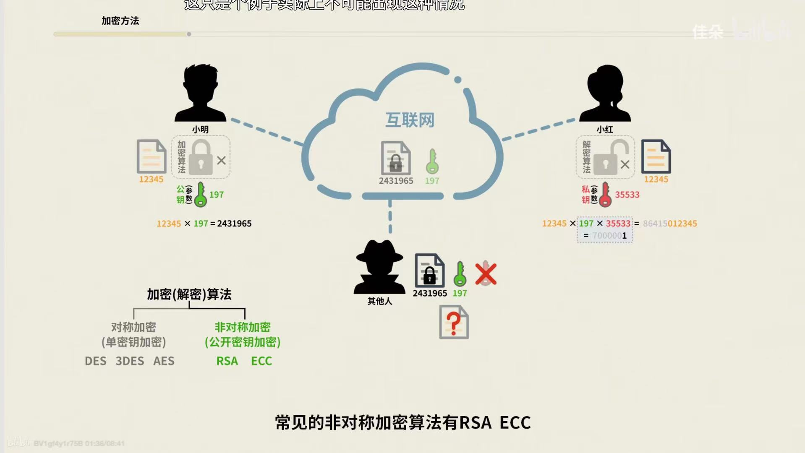
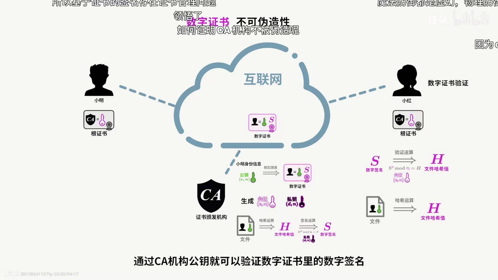

## （2021）字节一面

### 1.手写bind函数
### 2.实现一个算法，字符串包含“【】”“{}”，判断是否正确闭合

### 3.前端路由了解吗？有什么区别？

1. hash路由和history路由


### 4.ES6语法用过那些？用到过symbol吗？有哪些用处？


### 5.前端性能监控有了解吗？

1. 错误类型有那些？
2. 监控方式？：trycatchpromise.catch和window.onerror


### 6.说说白屏优化的方式有哪些？

1. 懒加载、预加载、预解析、按需加载、缓存、骨架屏


### 7.节流的作用？那些场景下可以用到？

### 8.说说浏览器的消息循环机制

### 9.transition和animation的区别？

### 10.说说requestAnimationFrame的作用，并实现获取每秒的帧数


## 字节二面

### 1.你能说说babel是怎么解析语法的吗？

1. 词法分析和语法分析的作用？
2. 词法和语法谁先执行？
3. 那些算是词法哪些算是语法？
4. const const a=1；词法分析能通过吗？是到语法分析才报错吗？


### 给个树形节点，包括value和children，求所有节点的value

1. 你觉得递归有什么缺点？（内存溢出和爆栈）
2. 爆栈属于什么类型的错误？系统错误还是？
3. 针对你说的问题怎么改进代码？（说了一下尾递归和将递归换成迭代）

### 浏览器的控制台是怎么渲染的？说说浏览器控制台输出console到输出显示的过程？

### DNS解析是去哪里找的解析？

### 怎么找到的DNS服务器？

### DNS是如何解析出ip的？解析出ip后怎么找到对方的？握手为什么要三次？万一第三次没有发出去呢？


### 明信片问题？

1. 你怎么保证不被快递员知道内容？
2. 快递员把信封拆掉呢？
3. 信封换掉了呢？
4. 陌生人怎么知道那些是权威的印章呢？
   

## 字节换部门一面

### css实现一个正三角形

### this相关的集到题目

### 原型链相关的题目

### 说说new的过程把

### 实现一个发布订阅者模式

### 说说header常见的字段有哪些？作用分别是什么？

### cookie有哪些字段？分别什么作用？

### access-contril-request-method作用？

### CSRF怎么防范

### 了解前端错误监控吗？

### 说说http和https的区别？

## 二面

### 让你来实现一个扫码支付的功能你会怎么实现？

### 如何防范iframe被钓鱼网站嵌套导致的安全问题？

### 实现一个深拷贝你会考虑到那些点？

## 三面

### 实现两个有序链表的合并

## 四面

### redux的实现原理你了解吗？

（没用过应该是发布订阅者模式？）

### 聊聊你知道的设计模式有哪些？

1. 单例

2. 策略

3. 装饰器

4. 发布订阅

5. 适配器

###  讲讲函数式编程的特点？


### 主流框架了解哪些？哪个比较熟悉？（Vue，看过部分源码）

给你一段template，写出编译成render函数后的代码（有个插值三目表达式没写出来）


### 说说Vue的依赖收集过程吧

当数据发生变化后，依赖会重新收集吗？


### 讲讲webpack的原理吧，你掌握到哪种程度？（熟悉优化插件、打包原理和热更新原理，看过核心源码）

loader和plugin实现过吗？知道原理吗？（讲了前者是函数，后者是类，两个编写形式的不同，同时在源码中的执行位置）
说说module、chunk、bundle、asset的区别？
chunk一定是通过入口生成的吗？（不一定，import动态加载的模块也会作为一个chunk）
css-loader的作用？（处理依赖关系）
css中的路径是如何解析的？（应该是通过file-loader解析（不太确定））
css-loader和file-loader如何一起工作的？（不太清楚了。）


### node以及express中间件
爬虫设计以及多进程通信
tls握手阶段介绍
#### 非对称加密，对称加密和分组加密，证书，消息认证码，防范中间人攻击



* 对称加密：单密钥加密（DES,3DES,AES）
简单来说就是将文件与公钥使用加密算法生成对应的加密文件，再将文件与公钥发给另一边，然后接收者使用文件与公钥进行解密

* 非对称加密（公开密钥加密）RSA,ECC
为了放置中间人拿到加密文件与公钥破解，使用非对称加密，接收者有一套私钥用于解密

加密逻辑是：接收者生成一套公钥私钥，发送给信息发送方，然后信息发送方使用这个公钥实现加密，然后将加密文件传输给接收方，接收方使用私钥解密出信息
目前主流使用的是RSA-2048加密

对于一个用户访问百度这样的主页，需要用到的就是ca证书来证明其真伪，


ca证书：也是发送者与接收者使用公钥私钥进行非对称加密，但是传输过程中的公钥需要证明其身份的真实性，这里就存在ca证书的必要

websocket
RESTFul 规范
webpack原理以及编译原理中词法分析，语法分析区别
React 的各种hook
diff算法，为什么Vue3.0要使用最长上升子序列做diff，而不是2.0的双端比较


♥一面

自我介绍

怎么判断JS的数据类型，所有方法

怎么判断对象和数组，所有方法

讲一下事件循环的过程，微任务，宏任务

HTML link标签的伪类有哪些 怎么用

想实现一个div标签，宽高成比例变化怎么实现

HTTP请求常用的方式

Head和option是做什么的

Get和 post的区别在哪，为什么
代码输出？

[1,2,3].map(parseInt)
实现一个函数
get({a:{b:[1,2,3]}}, ‘a.b[0]’) => 1

♥二面

自我介绍

介绍 项目

讲一下研究生阶段做的科研任务。这一块问了很多，面试官应该是很感兴趣

讲一下url从输入到展示页面的过程

CSSOM和DOM在浏览器中是怎么进行构建的。

讲一下token从开始到使用的过程

前端 受到常见的攻击，过程是什么，怎么防御

https比较http的安全性体现在什么地方，一定要用https吗？对http进行改造可以吗

Promise相关，与async，await关系

三级事件模型，每一级的特点

事件委托

垃圾回收机制，常用的是哪种，引用计数的缺点。

手写Promise.all

岛屿数量
♥三面

介绍 项目

复用的过程？然后面试官捏造了几个BUG问怎么优化

怎么优化图片的onload函数？然后又捏造了bug问怎么优化

Session和token的区别

session与cookie的关系

浏览器通过session认证用户状态的过程

在与后端进行通信的时候有哪些地方是 前端 可以优化的

CSRF的过程，如何应对

CSRF攻击时需不需要拿到本地的cookie(不需要)

闭包是什么，具体的应用有哪些

JQuery 源码 为什么是一个匿名自执行函数，拓展到了 webpack打包后的文件。

写一个深拷贝，考虑对象里有函数的情况

实现一个o(1)复杂度查找的队列

反问面试官 评价是写代码的能力很强，但是在 项目 工程化上太差。


####  1.讲一下cookie、 sessionStorage、 localStorage的区别，使用场景

cookie
字面意思为网络饼干，用于存储缓存数据

有数量和大小限制，不同浏览器限制不太一样，大小一般不超过4k

一般用于存储token，不适合存储大数据量

可以设置过期时间，存储用户登录状态非常合适

不同的二级域名下，cookie时可以共享的，如有两个二级域名：a.baidu.com,b.baidu.com

二者可以获取同一个token，设置token的时候指定path属性为：'/'

sessionStorage
会话存储，无数据量大小限制，当窗口关闭后，缓存就消失。

用于存储缓存数据，比如页面之间数据共享

localStorage
本地存储，除非手动清除，数据不会消失。

一般用于存储用户的基础数据，比如用户信息等


缺点：cookie：（1）大小受限

　　　　　　　　（2）用户可以操作（禁用）cookie，使功能受限

　　　　　　　　（3）安全性较低

　　　　　　　　（4）有些状态不可能保存在客户端。

　　　　　　　　（5）每次访问都要传送cookie给服务器，浪费带宽。

　　　　　　　　（6）cookie数据有路径（path）的概念，可以限制cookie只属于某个路径下。

 　　　　session：（1）Session保存的东西越多，就越占用服务器内存，对于用户在线人数较多的网站，服务器的内存压力会比较大。

　　　　　　　　（2）依赖于cookie（sessionID保存在cookie），如果禁用cookie，则要使用URL重写，不安全

　　　　　　　　（3）创建Session变量有很大的随意性，可随时调用，不需要开发者做精确地处理，所以，过度使用session变量将会导致代码不可读而且不好维护。


#### 2.怎么解决跨域？（讲了同源策略、jsonp、 cors、nginx、postmassage，每种都简单讲了一下）

同源策略：协议、主机、端口号三者相同

jsonp、、CORS、nginx、服务器代理请求

#### 3.介绍下CSS响应式布局和使用方式

* 响应式网站设计（Responsive Web design）是一种网络页面设计布局，页面的设计与开发应当根据用户行为以及设备环境(系统平台、屏幕尺寸、屏幕定向等)进行相应的响应和调整
* 响应式设计的基本原理是通过媒体查询检测不同的设备屏幕尺寸做处理，为了处理移动端，页面头部必须有meta声明viewport

实现响应式布局的方式有如下：

> 媒体查询:CSS3中的增加了更多的媒体查询，就像if条件表达式一样，我们可以设置不同类型的媒体条件，并根据对应的条件，给相应符合条件的媒体调用相对应的样式表
> 百分比:比如当浏览器的宽度或者高度发生变化时，通过百分比单位，可以使得浏览器中的组件的宽和高随着浏览器的变化而变化，从而实现响应式的效果
> vw/vh:vw表示相对于视图窗口的宽度，vh表示相对于视图窗口高度。 任意层级元素，在使用vw单位的情况下，1vw都等于视图宽度的百分之一
> rem:在以前也讲到，rem是相对于根元素html的font-size属性，默认情况下浏览器字体大小为16px，此时1rem = 16px


#### 4.详细讲下媒体查询和rem
#### 5.CMD、AMD 、ESM、 CommonJS 区别

总结：
总结
AMD/CMD/CommonJs 是js模块化开发的规范，对应的实现是require.js/sea.js/Node.js

CommonJs 主要针对服务端，AMD/CMD/ES Module主要针对浏览器端，容易混淆的是AMD/CMD。（顺便提一下，针对服务器端和针对浏览器端有什么本质的区别呢？服务器端一般采用同步加载文件，也就是说需要某个模块，服务器端便停下来，等待它加载再执行。这里如果有其他后端语言，如java。而浏览器端要保证效率，需要采用异步加载，这就需要一个预处理，提前将所需要的模块文件并行加载好。）

AMD/CMD区别，虽然都是并行加载js文件，但还是有所区别，AMD是预加载，在并行加载js文件同时，还会解析执行该模块（因为还需要执行，所以在加载某个模块前，这个模块的依赖模块需要先加载完成）；而CMD是懒加载，虽然会一开始就并行加载js文件，但是不会执行，而是在需要的时候才执行。

AMD/CMD的优缺点：一个的优点就是另一个的缺点， 可以对照浏览。
AMD优点：加载快速，尤其遇到多个大文件，因为并行解析，所以同一时间可以解析多个文件。
AMD缺点：并行加载，异步处理，加载顺序不一定，可能会造成一些困扰，甚至为程序埋下大坑。

CMD优点：因为只有在使用的时候才会解析执行js文件，因此，每个JS文件的执行顺序在代码中是有体现的，是可控的。

CMD缺点：执行等待时间会叠加。因为每个文件执行时是同步执行（串行执行），因此时间是所有文件解析执行时间之和，尤其在文件较多较大时，这种缺点尤为明显。（PS：重新看这篇文章，发现这里写的不是很准确。确切来说，JS是单线程，所有JS文件执行时间叠加在AMD和CMD中是一样的。但是CMD是使用时执行，没法利用空闲时间，而AMD是文件加载好就执行，往往可以利用一些空闲时间。这么来看，CMD比AMD的优点还是很明显的，毕竟AMD加载好的时候也未必就是JS引擎的空闲时间！）

CommonJS 和 ES Module 区别：CommonJS 模块输出的是一个值的拷贝，ES6 模块输出的是值的引用

如何使用？CommonJs 的话，因为 NodeJS 就是它的实现，所以使用 node 就行，也不用引入其他包。AMD则是通过<script>标签引入require.js，CMD则是引入sea.js


#### 6.Vue响应式原理

vue2.0是object.definproperty
vue3.0是proxy

#### 7.第一题是事件循环settimeout async/await promise 看代码说输出，题目没有记下来但是挺经典的。说完答案让我说下思路和js事件循环机制。
了解node吗？
#### 8.第二题是手写函数柯里化。太紧张了只实现了定参柯里化没实现不定参，面试官说没关系
也是一个手写题印象里挺难的但是具体忘记了，面试官点拨我写了十几分钟最后完成了大概80%
#### 9.算法 大数相加（秒）这个网易一面也考了，这个记得所以贴下代码

```ts
let a = "9007199****40991";
let b = "1234567899999999999";
function twoSum(a,b){
	var n = Math.max(a.length,b.length)
	a = a.padStart(n,0)
	b = b.padStart(n,0)
	var c = 0
	var res = ''
	for(let i = n-1 ; i>=0 ; i--){
	    t = parseInt(a[i]) + parseInt(b[i]) + c
	    c = Math.floor(t/10)
	    t = t%10
	    res = t + res
	}
	if (c === 1){
	    res = ‘1’ + res
	}
	return res
}
```

#### 字节二面

1. 上来第一道就是一道算法，具体忘了但是挺简单的我就用了数组的api实现的，中间有个地方卡住了我就问了下面试官，面试官语气就有点不耐烦，说我简单问题写复杂了，我就道歉说我第一个想到的方法就是这个（卑微
2. 手写Promise.all 这个网易二面也考了  还记得


如果要你用promise实现最大并发数限制的这样的函数，你怎么实现？（估计是真正实现可能要写很久所以就让我讲思路，我猜测了一下说设置limit和两个队列，一个队列长度达到limit之后剩余的放进另一个队列，回调放到then里面或者resolve 里面，面试官想了一下和我说可以。问我具体实现方式我就说了递归，他表示认可）
第三题题目描述很模糊。我题目都没怎么明白…我就问面试官是不是我理解的那个意思，他也没有明答就是嘲讽我看不懂题目。我当时真的快哭了（看不懂硬写），我就按我自己的理解用 promise写，他说不对不是这个意思，说时间来不及了就先跳过吧。当时面到这里已经半个小时多了，已经被二面面试官搞的心态崩了，不想再继续面了，因为没写出来心里想着"挂就挂吧无所谓了"，后面面的时候已经麻了
#### 1.讲下线程/进程的区别 （顺便说了下浏览器五个进程

* 进程是对正在运行中的程序的一个抽象，是系统进行资源分配和调度的基本单位
* 线程（thread）是操作系统能够进行运算调度的最小单位，其是进程中的一个执行任务（控制单元），负责当前进程中程序的执行

* 浏览器五个进程：
* 1.浏览器进程
* 2.渲染进程：主要作用是页面渲染、脚本执行、事件处理等，
* 3.GPU进程
* 4.网络进程
* 5.插件进程


#### 2.聊聊你对webpack的理解（讲的比较深，从webpack流程、plugin 、loader讲到全局单例模式Compiler和热更新）


webpack打包流程：


（1）初始化参数：解析webpack配置参数，合并shell传入和webpack.config.js文件配置的参数，形成最后的配置结果。

（2）开始编译：上一步得到的参数初始化compiler对象，注册所有配置的插件，插件监听webpack构建生命周期的事件节点，做出相应的反应，执行对象的 run 方法开始执行编译。

（3）确定入口：从配置的entry入口，开始解析文件构建AST语法树，找出依赖，递归下去。

（4）编译模块：递归中根据文件类型和loader配置，调用所有配置的loader对文件进行转换，再找出该模块依赖的模块，再递归本步骤直到所有入口依赖的文件都经过了本步骤的处理。

（5）完成模块编译并输出：递归完事后，得到每个文件结果，包含每个模块以及他们之间的依赖关系，根据entry配置生成代码块chunk。

（6）输出完成：输出所有的chunk到文件系统。


*  loader运行在打包文件之前（loader为在模块加载时的预处理文件）
* plugins在整个编译周期都起作用。

关于webpack热模块更新的总结如下：

通过webpack-dev-server创建两个服务器：提供静态资源的服务（express）和Socket服务
express server 负责直接提供静态资源的服务（打包后的资源直接被浏览器请求和解析）
socket server 是一个 websocket 的长连接，双方可以通信
当 socket server 监听到对应的模块发生变化时，会生成两个文件.json（manifest文件）和.js文件（update chunk）
通过长连接，socket server 可以直接将这两个文件主动发送给客户端（浏览器）
浏览器拿到两个新的文件后，通过HMR runtime机制，加载这两个文件，并且针对修改的模块进行更新


#### 3.说说你认为的promise（回调地狱，回调结果分别处理，链式调用）
看过vue源码吗，讲一下 watch和computed 的区别（分析源码 blabla
知道什么优化前端请求速度的方法（讲了CDN、缓存、 defer、雪碧图、webpack等）
八股若干，应该还有三四问但是记不起来了，但是自我感觉答得都还行，努力讲的比较深希望拉回一点印象
反问。面试官说我知识面很广比较全是可以肯定的，思路也还可以就是基础不行要我多练练，从我第一题简单问题复杂化就可以看出来基础不行


#### 字节三面

手写题：函数柯里化不定参（一面考过柯里化但是当时没答好，回去好好复习了一下，三面居然又问了。时间比较近还记得所以贴一下代码。
```ts
//实现函数,控制台打印结果
add(1,2,3,4).sumOf();//10
add(1)(2,3)(4).sumOf();//10
add(1,2)(3).sumOf();//6

//我的答案
function add(){ 
    let res = [...arguments];   
    let adder = (...args)=>{    
        res.push(...args);     
        return adder;   
        }   
        adder.sumOf = ()=> 
        {     
            console .log(res.reduce((a,b)=>a+b));
              
        }   
        return adder; 
        }
```


你用到了闭包，那你觉得闭包带来了什么好处和问题
说到内存泄漏，你知道有什么可以检测内存泄漏的方法吗（不知道，猜着回答了说可以用devTools LightHouse ）
说到LightHouse，你有用过吗（没有，就知道它有红黄绿三种颜***分性能）
你知道哪些性能指标？（说了首次渲染时间、白屏、交互时间、速度指标等）
说下网络参考模型的每层分别是什么？（问他是OSI七层模型还是 TCP/IP五层模型，他说OSI）
TCP、UDP 是哪一层？HTTP是哪一层？
对于TCP和 UDP你觉得最大的区别是什么？
你了解DNS吗 （讲了概念，详细讲了dns查询过程）
能说下HTTP和 HTTPS的差别吗（从SSL/TLS、对称、非对称加密，到CA 证书，hash，中间人攻击，以及整体https请求过程，说得比较详细）
说到加密算法，你知道有哪些对称加密、非对称加密算法吗？（对称的说了DES ，非对称的说了RSA）
你知道RSA内部怎么实现的吗？
讲下浏览器缓存（说了强缓存cache-control ，expire，协商缓存E-tag、If-Modified-Since ，说明了一下强缓存和协商缓存的命中顺序和使用场景）
看过webpack源码吗？说下你认为的 plugin和 loader的区别（分析源码 blabla
你最近有了解什么新的前端技术？（因为刚好问到webpack 所以说了尤大的Vite，讲了一下vite和webpack 的区别和优点）
看你在我们青训营里用过React，说说和编写Vue时的感觉差别？
唠嗑（你最大的优点，缺点，能实习多久，考不考虑转正，学校封控严不严格等，面试官真的很和蔼）

