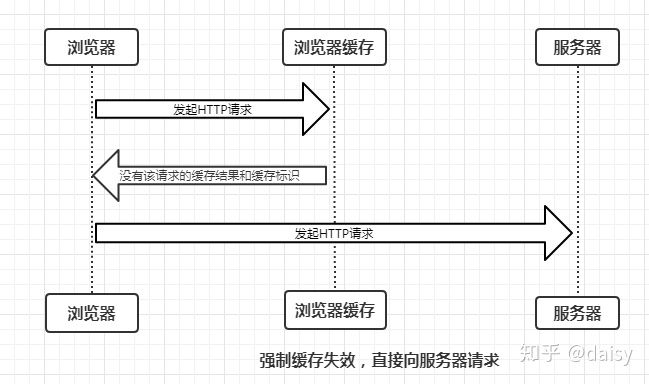

- 准备时间8月1日

- [杭州数澜科技一面](#杭州数澜科技一面)
  - [自我介绍](#自我介绍)
  - [项目介绍](#项目介绍)
  - [1.用过svg吗，讲讲svg与canvas](#1用过svg吗讲讲svg与canvas)
  - [2.讲解一下如何利用d3实现柱状图从0-100的移动](#2讲解一下如何利用d3实现柱状图从0-100的移动)
  - [3.](#3)
- [杭州智能涂鸦一面](#杭州智能涂鸦一面)
  - [自我介绍](#自我介绍-1)
  - [项目介绍](#项目介绍-1)
  - [1.用过css的什么，知道浮动窗口吗，如何实现的，](#1用过css的什么知道浮动窗口吗如何实现的)
  - [2.讲一下你的简历中的项目，流程是什么样的，](#2讲一下你的简历中的项目流程是什么样的)
  - [3.讲一下es6的var与let](#3讲一下es6的var与let)
  - [4.讲一下js的闭包，是什么？（谈谈对闭包的理解，闭包的用途，闭包的缺点）](#4讲一下js的闭包是什么谈谈对闭包的理解闭包的用途闭包的缺点)
  - [5.知道es6的promise函数吗？讲解一下](#5知道es6的promise函数吗讲解一下)
  - [6.知道那些有关前端的安全问题，如何防范？](#6知道那些有关前端的安全问题如何防范)
- [杭州数澜科技二面](#杭州数澜科技二面)
- [杭州数澜科技三面](#杭州数澜科技三面)
- [菜鸟裹裹](#菜鸟裹裹)
  - [类组件与函数组件生命周期有何区别，分别解释一下](#类组件与函数组件生命周期有何区别分别解释一下)
  - [useMemo与useCallback解释一下](#usememo与usecallback解释一下)
  - [什么情况下会遇到跨域，描述一下，前端常见的处理跨域的几种方式](#什么情况下会遇到跨域描述一下前端常见的处理跨域的几种方式)
  - [浏览器有几种缓存方式，分别介绍一下](#浏览器有几种缓存方式分别介绍一下)
  - [深拷贝与浅拷贝](#深拷贝与浅拷贝)
  - [Promise函数传来了几个参数(作用是什么)](#promise函数传来了几个参数作用是什么)
  - [钩子函数传参类型分别有那些](#钩子函数传参类型分别有那些)
- [浩鲸科技（外包）](#浩鲸科技外包)
  - [js中有多少个数据类型](#js中有多少个数据类型)
  - [for...in与for...of的区别](#forin与forof的区别)
  - [NaN是什么类型的（typeof(NaN)）](#nan是什么类型的typeofnan)
  - [介绍一下let const 与var](#介绍一下let-const-与var)
  - [给你两个对象分别是5和6，让你不用第三方变量进行交换，如何实现](#给你两个对象分别是5和6让你不用第三方变量进行交换如何实现)
  - [闭包是什么，有什么特性，对页面有什么影响](#闭包是什么有什么特性对页面有什么影响)
  - [箭头函数](#箭头函数)
  - [react生命周期介绍一下](#react生命周期介绍一下)
  - [react-router的hash模式和history模式有何区别](#react-router的hash模式和history模式有何区别)
  - [webpack的loader和plugin的区别](#webpack的loader和plugin的区别)
  - [webpack的构建流程](#webpack的构建流程)
  - [防抖函数](#防抖函数)
  - [节流函数](#节流函数)
  - [useEffect传入的参数可以使用对象吗](#useeffect传入的参数可以使用对象吗)
  - [组件间通信可以使用那些方法](#组件间通信可以使用那些方法)
  - [原型原型链是什么](#原型原型链是什么)
  - [ES6有哪些新特性](#es6有哪些新特性)
  - [数据间通信有哪些方式总结一下](#数据间通信有哪些方式总结一下)
  - [浏览器输入url发生了什么描述一下](#浏览器输入url发生了什么描述一下)
- [上海小公司](#上海小公司)
  - [聊聊你做过那些自定义的hooks](#聊聊你做过那些自定义的hooks)
  - [HOC了解吗，实现过那些](#hoc了解吗实现过那些)
  - [使用useEffect钩子函数的时候object对象是否可以作为被监听的对象](#使用useeffect钩子函数的时候object对象是否可以作为被监听的对象)
  - [如何判断一个对象是空对象](#如何判断一个对象是空对象)
- [木链科技](#木链科技)
  - [讲讲项目如何实现](#讲讲项目如何实现)
  - [讲讲如何实现多数据页面展示卡顿的处理](#讲讲如何实现多数据页面展示卡顿的处理)
  - [聊聊时间定时器应该选择那个？settimeout还是settimeinterval](#聊聊时间定时器应该选择那个settimeout还是settimeinterval)
  - [讲讲d3.js与three.js的区别与异同](#讲讲d3js与threejs的区别与异同)
  - [讲讲浮动float](#讲讲浮动float)
  - [讲讲事件循环机制event loop](#讲讲事件循环机制event-loop)
- [有赞](#有赞)
  - [new string赋值给a，a的类型是什么](#new-string赋值给aa的类型是什么)
  - [es6有哪些类型（基本数据类型、复杂数据类型）](#es6有哪些类型基本数据类型复杂数据类型)
  - [聊聊es6的symbol](#聊聊es6的symbol)
  - [如何知道一个对象上的属性是否可以枚举](#如何知道一个对象上的属性是否可以枚举)
  - [promise聊聊](#promise聊聊)
  - [函数内部的this指向以及如何改变函数内部的指向](#函数内部的this指向以及如何改变函数内部的指向)
  - [promise.all与.race的区别](#promiseall与race的区别)
  - [聊聊promise.finally()](#聊聊promisefinally)
  - [javascript的map与object的区别](#javascript的map与object的区别)
  - [object的key值有哪些类型](#object的key值有哪些类型)
  - [flex布局的默认方向,什么参数可以修改](#flex布局的默认方向什么参数可以修改)
  - [组件优化渲染的方法有哪些](#组件优化渲染的方法有哪些)
  - [react渲染中的key你知道吗，](#react渲染中的key你知道吗)
  - [webpack与babel一起使用吗，聊聊之间的关系](#webpack与babel一起使用吗聊聊之间的关系)
  - [node.js做什么的，简单聊聊](#nodejs做什么的简单聊聊)
  - [git操作暂存区和工作区是什么做什么的](#git操作暂存区和工作区是什么做什么的)
  - [git如何将工作区储存到暂存区](#git如何将工作区储存到暂存区)
  - [代码：](#代码)
- [博彦科技](#博彦科技)
  - [react生命周期](#react生命周期)
  - [js的作用域与作用域链](#js的作用域与作用域链)
  - [const定义的属性可否被改变](#const定义的属性可否被改变)
  - [了解es6吗，聊聊有哪些新特性](#了解es6吗聊聊有哪些新特性)
  - [空对象是真还是假](#空对象是真还是假)
  - [了解apply,call,bind（）吗，讲讲](#了解applycallbind吗讲讲)
  - [this指针的指向](#this指针的指向)
  - [讲讲let与const](#讲讲let与const)
  - [原型与原型链](#原型与原型链)
- [火石创造](#火石创造)
  - [讲讲几种类型判断](#讲讲几种类型判断)
  - [继承如何实现](#继承如何实现)
  - [数组头部添加元素有哪几种方式](#数组头部添加元素有哪几种方式)
  - [事件循环机制](#事件循环机制)
  - [数组遍历的方法](#数组遍历的方法)
  - [数组如何去重](#数组如何去重)
  - [foreach与map的区别](#foreach与map的区别)
  - [call，bind，apply](#callbindapply)
  - [项目优化的心得](#项目优化的心得)
  - [vue的v-show与v-if](#vue的v-show与v-if)
  - [vue的computed与watch的区别](#vue的computed与watch的区别)
  - [vue中的data为什么不是对象而是返回方法](#vue中的data为什么不是对象而是返回方法)
  - [vue的组件通信的方式](#vue的组件通信的方式)
- [火石二面](#火石二面)
  - [讲讲浏览器渲染原理](#讲讲浏览器渲染原理)
  - [数据缓存，与缓存](#数据缓存与缓存)
  - [如何将数组中的每个元素插入新的元素](#如何将数组中的每个元素插入新的元素)
  - [三个按钮都有对应的接口，如果a按钮按下，数据没有请求到，b按钮又按下，数据请求到了，怎么解决这个数据冲突的问题](#三个按钮都有对应的接口如果a按钮按下数据没有请求到b按钮又按下数据请求到了怎么解决这个数据冲突的问题)
  - [前端数据处理讲讲，](#前端数据处理讲讲)
  - [有一个数组，如何做到对数组的每个对象都插入你想要的值与元素](#有一个数组如何做到对数组的每个对象都插入你想要的值与元素)
- [Teamind](#teamind)
  - [promise 有一个settimeout，然后promise.then再嵌套一个then的输出顺序是什么](#promise-有一个settimeout然后promisethen再嵌套一个then的输出顺序是什么)
  - [讲讲css的优先级](#讲讲css的优先级)
  - [如果同事编写了！important，请问如何不修改的情况下，取消这个效果](#如果同事编写了important请问如何不修改的情况下取消这个效果)
  - [重绘与回流（重排）聊聊](#重绘与回流重排聊聊)
  - [react生命周期的理解](#react生命周期的理解)
  - [react的useeffect执行了return后，如果再重新渲染，执行顺序是什么](#react的useeffect执行了return后如果再重新渲染执行顺序是什么)
  - [js多线程的理解](#js多线程的理解)
  - [antd有什么优缺点](#antd有什么优缺点)
- [海康威视](#海康威视)
  - [讲讲css的几个定位](#讲讲css的几个定位)
  - [你是怎么理解CSS的相对定位](#你是怎么理解css的相对定位)
  - [讲讲CSS样式优先级](#讲讲css样式优先级)
  - [使用css绘制一个三角形](#使用css绘制一个三角形)
  - [settimout定时器写如果写了三秒，为什么最后延迟了5秒才打印](#settimout定时器写如果写了三秒为什么最后延迟了5秒才打印)
  - [settimout定时器写0，有什么用](#settimout定时器写0有什么用)
  - [如何实现垂直居中](#如何实现垂直居中)
  - [event loop事件循环机制](#event-loop事件循环机制)
  - [CSS栅格系统介绍一下](#css栅格系统介绍一下)
  - [em、rem区别介绍](#emrem区别介绍)
  - [z-index的理解](#z-index的理解)
  - [Cookie是什么，拿来做什么的，可以储存什么](#cookie是什么拿来做什么的可以储存什么)
  - [web 本地存储 （cookie、session）说说localStorage和SessionStorage应用](#web-本地存储-cookiesession说说localstorage和sessionstorage应用)
  - [如何解决跨域，为什么会出现跨域](#如何解决跨域为什么会出现跨域)
  - [CORS通信](#cors通信)
  - [正向代理 反向代理 本质区别](#正向代理-反向代理-本质区别)
  - [async await 异步操作的逻辑](#async-await-异步操作的逻辑)
  - [async和await如何捕获错误](#async和await如何捕获错误)
  - [Nginx请求处理流程](#nginx请求处理流程)
  - [页面加载速度缓慢时，如何优化？(首屏加载速度慢)](#页面加载速度缓慢时如何优化首屏加载速度慢)
- [同花顺](#同花顺)
  - [](#)

## 杭州数澜科技一面

### 自我介绍

### 项目介绍

### 1.用过svg吗，讲讲svg与canvas

canvas（相当于ps）：字面意思就是画布，canvas通过结合javascript来绘制各种图形

1. 使用js动态生成
2. 基于位图（像素），不要随便放大缩小
3. 修改后重绘

svg（画布相当于ai）：
1. 使用xml静态描绘
2. 基于矢量（公式）
3. 修改后不需要重绘


### 2.讲解一下如何利用d3实现柱状图从0-100的移动

### 3.


## 杭州智能涂鸦一面

### 自我介绍

### 项目介绍

### 1.用过css的什么，知道浮动窗口吗，如何实现的，


   float 是一种选择，但是使用 inline-block 会更简单。让我们看下使用这两种方法的例子：

* 试用float方法
```css
.box {
  float: left;
  width: 200px;
  height: 100px;
  margin: 1em;
}
.after-box {
  clear: left;
  /* 取消浮动 */
}

```

* 容易的方式（使用 inline-block）你可以用 display 属性的值 inline-block 来实现相同效果。

```css
.box2 {
  display: inline-block;
  width: 200px;
  height: 100px;
  margin: 1em;
}
```

    

### 2.讲一下你的简历中的项目，流程是什么样的，

### 3.讲一下es6的var与let

es5 提出了var 对象，分别在es6提出了let 与const对象

**区别：**
1. 是否存在变量提升
* 变量提升：变量可以在申明之前使用。

* var 声明的变量存在变量提升，全局作用域下是 window 属性。

```javascript
console.log(a);//undefined,a 变量提升到前面，相当于 var a;a = 10;
var a = 10;
console.log(a);//报错 Cannot access 'a' before initialization
//变量无法提升;
let a = 10;

console.log(b);//报错 Cannot access 'b' before initialization
//变量无法提升;
const b = 10;

```

2. 能否重复声明

* var 能重复声明，而let与const都不能重复声明

3. 变量值能否修改
   
* var 和 let 声明的值可以修改，而const声明是常量不能修改，但如果声明的是引用类型，可以修改其属性，例如echarts的option

4. 是否必须设置初始值

* var 和 let 声明时可以不用设置初始值，const 声明时必须设置初始值，不能使用 null 占位。

5. 是否存在块级作用域

* 块级作用域：申明的变量只在该块级作用域内有效。
* var 没有块级作用域,另外两个存在块级作用域

6. 是否存在暂时性死区

* var 不存在暂时性死区，另外两个存在

| 区别               | var | let | const |
| ------------------ | --- | --- | ----- |
| 是否存在变量提升   | 是  | 否  | 否    |
| 是否能重复声明     | 是  | 否  | 否    |
| 变量值能否修改     | 能  | 能  | 否    |
| 是否必须设置初始值 | 否  | 否  | 是    |
| 是否存在块级作用域 | 否  | 是  | 是    |
| 是否存在暂时性死区 | 否  | 是  | 是    |


### 4.讲一下js的闭包，是什么？（谈谈对闭包的理解，闭包的用途，闭包的缺点）

+ 闭包是指有权访问另外一个函数作用域中的变量的函数
+ 闭包的用途：
1. 设计私有的方法和变量。
2. 匿名函数最大的用途是创建闭包，并且还可以构建命名空间，以减少全局变量的使用。从而使用闭包模块化代码，减少全局变量的污染。
+ 闭包的缺点：
1. 闭包会使得函数中的变量都被保存在内存中，滥用闭包可能导致内存泄漏。解决方法是在函数退出之前，将不使用的局部变量全删了。
2. 闭包会在父函数外部，改变父函数内部变量的值。


### 5.知道es6的promise函数吗？讲解一下

* 目的：
* 为了解决回调地狱的问题，之后社区提出了 Promise 的解决方案，ES6 又将其写进了语言标准，采用 Promise 的实现方式在一定程度上解决了回调地狱的问题


* Promise 到底是什么，简单来说它就是一个容器，里面保存着某个未来才会结束的事件（通常是异步操作）的结果。从语法上说，Promise 是一个对象，从它可以获取异步操作的消息。

Promise 提供统一的 API，各种异步操作都可以用同样的方法进行处理

### 6.知道那些有关前端的安全问题，如何防范？

一、XSS(Cross Site Scripting)跨站JS脚本攻击，如何防范？

* 针对接口进行 XSS攻击，即把js脚本或者带恶意js脚本的html标签，作为GET或者POST参数提交到服务器，然后服务器解释并响应
* 防范方式：
* 1）提交数据前前端要做数据校验，对用户输入的信息(js代码及dom节点)进行过滤。
* 2）对重要的cookie设置为httponly（服务器端可设置此字段），客户端就没有操作此cookie的权限。
* 3）服务器端也要数据合法性校验
针对DOM本身进行 XSS攻击，如果本身页面代码中使用了window.eval来执行代码。eval本身会把一段字符串变成可执行的js代码，这是非常危险的。还有拼接html字符串后直接显示DOM时也会遇到同样的问题。防范方式：尽量避免使用eval，拼接html字符串时应校验字符串的合法性，过滤非法元素节点与属性节点,如iframe,script标签，onerror事件, style, src, href等。
 
* 可能产生危害：泄露了个人的cookie信息，身份认证被套取后，被用作非法用途

* 非法字符过滤可以使用第三方的过滤库如：HTMLParser.js及he.js

二、CSRF(Cross-site request forgery)跨站请求(GET和POST)伪造攻击，如何防范？ 

* 由于浏览器一般都是可同时打开多标签的。举个例了，现浏览器同时打开了两个标签，一个是已被合法登录并保持登录状态的网站A，另外一个是已被欺骗打开的含恶意代码的网站B（不一定是来源于非法网站，也可能藏在各大合法论坛上的一些非法链接被你打开了），则可以通过在恶意网站B上静态或者动态创建img,script等标签发起GET或者POST请求，发出的恶意请求是身份认证后的，这就构成CSRF攻击了。将其src属性指向发起对A网站的接口请求（如一个GET请求：api.a.com/blog/del?id=1）。通过标签的方式发起的请求不受同源策略的限制。

* 可能产生危害：模拟表单提交盗取用户资金，篡改目标网站上的用户数据，盗取用户隐私数据

* 防范方式：
* 1）后端接口要对接口请求来源如（* Referer:）字段进行合法校验。
* 2）添加token，带token请求。


三、SQL注入，攻击如何防范？

1. 永远不要信任用户的输入。对用户的输入进行校验，可以通过正则表达式，或限制长度；对单引号和双"-"进行转换等。

2. 永远不要使用动态拼装sql，可以使用参数化的sql或者直接使用存储过程进行数据查询存取。

3. 永远不要使用管理员权限的数据库连接，为每个应用使用单独的权限有限的数据库连接。

4. 不要把机密信息直接存放，加密或者hash掉密码和敏感的信息。

5. 应用的异常信息应该给出尽可能少的提示，最好使用自定义的错误信息对原始错误信息进行包装

6. sql注入的检测方法一般采取辅助软件或网站平台来检测，软件一般采用sql注入检测工具jsky,网站平台就有亿思网站安全平台检测工具。


四、接口访刷问题，前端如何与后端配合？

* 在IT行业混得有一点资历的人估计都会遇到过接口被刷的情况了。如：听说搞某某活动，大奖瞬间被刷走。某某营销活动，奖品瞬间被抢光了。某某平台，短信验证码几天被刷到欠费。

认真去查查记录，发现这些行为都是人家用机器写程序自动刷你接口的。现在还有卡商有各种短信接码平台，专业批量接发验证码的。

如何能更好的做接口防刷：

1. 发送请求之前前端这边要做人机识别。（如微信的静默授权返回一次唯一码，小程序的wx.login接口返回的code，可供后端二次验证，还有发送短信验证码前要手动先输入验证码，或者使用拖动方块填充缺块那种人机识明系统）

2. 接口传参要带加密签名。

五、前端常用的加密方式有哪些？

sha1，base64，md5，SHA256，SHA512，RMD160等

常用开源库有：

https://github.com/blueimp/JavaScript-MD5

https://github.com/h2non/jshashes

https://github.com/dankogai/js-base64

## 杭州数澜科技二面

项目组leader聊团队氛围以及团队分工

## 杭州数澜科技三面

薪资待遇以及之前的工作情况

## 菜鸟裹裹

### 类组件与函数组件生命周期有何区别，分别解释一下

   类组件，通过es6类的编写形式去编写组件，必须继承React.component，想要访问父组件传递过来的参数，可通过this.props访问
   在组件中必须实现render方法，在return中返回react对象

   函数组件，使用函数的形式编写一个react组件，


* 两类react组件，其区别主要分为以下几个方向：
* 编写形式
* 状态管理
* 生命周期
* 调用方式
* 获取渲染的值

1. 编写形式：

```javascript
// 函数组件：
function get(props){
  return <h1>props.name</h1>
}

//类组件：
class get extends React.Component{
  //构造器
  constructor(props){
    super(props)
  }
  render(){
    return<h1>this.props.name</h1>
  }
}

```
2. 状态管理：
  
```javascript
// 函数组件：在hooks出来之前，函数组件是没有状态组件的，不能保管组件的状态，不像类组件调用setstate
//出来usestate后，就可以实现如同类组件一样的效果使用状态
const[state,setstate]=useState(0);
//在使用hooks的情况下，一般函数组件调用state，则需要创建一个类组件或者state提升到你的父组件中，然后通过props对象传递到子组件
//类组件：本身就存在状态管理的情况
```

3. 生命周期

* 在函数组件中，并不存在生命周期，因为这些生命周期函数钩子都来自继承的React.Component
* 所以，如果用到生命周期，就只能使用类组件
* 但是函数组件使用的useEffect也能够代替生命周期的作用，

```javascript
//下面这段对应componentDidMount生命周期
const Demo=()=>{
  useEffect(()=>{
    console.log('hi')
  },[]);
  return<h1>hello!</h1>
}

//这段对应componentWillUnmount生命周期
const Demo=()=>{
  useEffect(()=>{
    return()=>{
      console.log("bye")
    }
  },[]);
  return<h1>bye!</h1>
}
//下面这段模拟componentDidUpdate
//在此之前需要使用useRef这个hooks
const flag = React.useRef(null)
React.useEffect(() => {
	if(!flag.current){
		flag.current = true
	} else {
		console.log("更新了")
	}
})
//在官网的文档有提到在useeffect钩子函数最后的第二参数，用于监听那个状态的变化，如果变化则执行内部函数：
//在这里我们没有传第二个参数，也就是说他默认监听所有状态，只要有状态发生改变，他就会执行，
```

4. 取出渲染的值

* 类组件与函数组件功能基本一致，但是在类组件中，输出this.props.user,Props在react中是不可变的，但是this总是可变的，以便您可以在render和生命周期函数中读取新版本
* 
### useMemo与useCallback解释一下


   function useMemo<T>(factory: () => T, deps: DependencyList | undefined): T; 
   function useCallback<T extends (...args: any[]) => any>(callback: T, deps: DependencyList): T;

> useCallback和useMemo的参数跟useEffect一致，他们之间最大的区别有是useEffect会用于处理副作用，而前两个hooks不能。
> useMemo和useCallback都会在组件第一次渲染的时候执行，之后会在其依赖的变量发生改变时再次执行；并且这两个hooks都返回缓存的值，useMemo返回缓存的变量，useCallback返回缓存的函数。

讲完了useMemo，接下来是useCallback。useCallback跟useMemo比较类似，但它返回的是缓存的函数。我们看一下最简单的用法：

> const fnA = useCallback(fnB, [a])
> 上面的useCallback会将我们传递给它的函数fnB返回，并且将这个结果缓存；当依赖a变更时，会返回新的函数。既然返回的是函数，我们无法很好的判断返回的函数是否变更，所以我们可以借助ES6新增的数据类型Set来判断，具体如下：

多谈一点
useEffect、useMemo、useCallback都是自带闭包的。也就是说，每一次组件的渲染，其都会捕获当前组件函数上下文中的状态(state, props)，所以每一次这三种hooks的执行，反映的也都是当前的状态，你无法使用它们来捕获上一次的状态。对于这种情况，我们应该使用ref来访问。

### 什么情况下会遇到跨域，描述一下，前端常见的处理跨域的几种方式

广义上：
1.  资源跳转： A链接、重定向、表单提交
2.  资源嵌入： **link、script、img、frame**等dom标签，还有样式中background:url()、@font-face()等文件外链
3.  脚本请求： js发起的ajax请求、dom和js对象的跨域操作等

跨域解决方案
1. 通过jsonp跨域

JSONP 是服务器与客户端跨源通信的常用方法。最大特点就是简单适用，兼容性好（兼容低版本IE），缺点是只支持get请求，不支持post请求。

核心思想：网页通过添加一个<script>元素，向服务器请求 JSON 数据，服务器收到请求后，将数据放在一个指定名字的回调函数的参数位置传回来。


2. document.domain + iframe跨域
3. location.hash + iframe
4. window.name + iframe跨域
5. postMessage跨域
6. 跨域资源共享（CORS）

[http://www.ruanyifeng.com/blog/2016/04/cors.html](http://www.ruanyifeng.com/blog/2016/04/cors.html)
ORS 是跨域资源分享（Cross-Origin Resource Sharing）的缩写。它是 W3C 标准，属于跨源 AJAX 请求的根本解决方法。

1、普通跨域请求：只需服务器端设置Access-Control-Allow-Origin

2、带cookie跨域请求：前后端都需要进行设置

【前端设置】根据xhr.withCredentials字段判断是否带有cookie
【服务端设置】服务器端对于CORS的支持，主要是通过设置Access-Control-Allow-Origin来进行的。如果浏览器检测到相应的设置，就可以允许Ajax进行跨域的访问。

7、 nginx代理跨域

在webpack.config.js中利用 WebpackDevServer 配置本地代理，详情配置查看devServer

如下简单配置案例，这样 `http://localhost:8080/api/getUser.php` 的请求就是后端的接口 `http://192.168.25.20:8088/getUser.php`


8、 nodejs中间件代理跨域
9、 WebSocket协议跨域

Websocket 是 HTML5 的一个持久化的协议，它实现了浏览器与服务器的全双工通信，同时也是跨域的一种解决方案。WebSocket 和 HTTP 都是应用层协议，都基于 TCP 协议。但是 WebSocket 是一种双向通信协议，在建立连接之后，WebSocket 的 服务器与 客户端都能主动向对方发送或接收数据。同时，WebSocket 在建立连接时需要借助 HTTP 协议，连接建立好了之后 client 与 server 之间的双向通信就与 HTTP 无关了。


### 浏览器有几种缓存方式，分别介绍一下

浏览器有强制缓存与协商缓存两种方式，

* 强制缓存
  
强制缓存就是向浏览器缓存查找该请求结果，并根据该结果的缓存规则来决定是否使用该缓存结果的过程，强制缓存的情况主要有三种(暂不分析协商缓存过程)：

不存在该缓存结果和缓存标识，强制缓存失效，则直接向服务器发起请求（跟第一次发起请求一致），如下图：



* 协商缓存
  
当浏览器的强缓存失效的时候或者请求头中设置了不走强缓存，并且在请求头中设置了If-Modified-Since 或者 If-None-Match 的时候，会将这两个属性值到服务端去验证是否命中协商缓存，如果命中了协商缓存，会返回 304 状态，加载浏览器缓存，并且响应头会设置 Last-Modified 或者 ETag 属性。

### 深拷贝与浅拷贝

- 浅拷贝，**如果被拷贝的属性是基本类型，拷贝的就是基本类型的值；如果数据属性是引用类型，拷贝的就是内存地址**
- 由于引用是指针上的引用，没有改变对象的储存地址，当在引用对象进行了修改，原始数据上也会进行修改


- 而深拷贝，从堆内存中开辟一个新的区域存放新对象，对对象中的子对象进行递归拷贝，拷贝前后的两个对象互不影响。
- 当拷贝完成，那么你在修改新的对象的时候，并不会出现原始对象也被修改的情况
- 内存中有栈区和堆区，基本类型数据直接存在栈中，而引用类型（new出来的）是在堆中存储，在栈中保存堆中的地址。


- 也就是说引用类型中在栈中存的不是数据，而是地址。赋值其实就是拷贝。在基本类型数据赋值的时候，没有深浅拷贝的区别，因为直接赋予的是数据。
- 但在引用类型数据赋值的时候，实际上是把原来的地址复制给了新的，并没有实际复制其中的数据，所以这是一个浅拷贝（拷贝的深度不够），

1. 浅拷贝与赋值的区别：
- 赋值：当我们把一个对象赋值给一个新的变量时，赋值的其实时该对象在栈中的地址，而不是堆中的数据，也就是两个对象指向的时同一个储存空间，无论那个对象发生改变，其实改变的都是储存空间的内容
- 浅拷贝：重新在堆中创建内存，拷贝哦前后对象的基本数据类型互不影响(Undefined、Null、Boolean、Number和String是基本数据类型)，但拷贝前后对象的引用类型因共享一块内存，会互相影响。(引用数据类型也就是对象数据类型object，比如：object、array、function、data等；)
- 深拷贝：从堆内存中开辟一块新的区域存放新对象，堆对象中的子对象进行递归拷贝，拷贝前后的两个对象互不影响。

2. 浅拷贝的实现方式：

- Object.assign()，es5
- lodash里面中的_.clone
- ...展开运算符，es6
- Array.prototype.concet()
- Array.prototype.slice()


1. 深拷贝的实现方式：
   
- JSON.parse(JSON.stringify())-->有弊端，会让Date，function都会消失
- 递归的操作
- cloneDeep
- Jquery.extend()


```javascript
//浅拷贝
function shallowCopy(obj){
  var target={}
  for(var i in obj){
    if(obj.hasOwnProperty(i)){
      //hasOwnProperty() 方法会返回一个布尔值，指示对象自身属性中是否具有指定的属性（也就是，是否有指定的键）。
      target[i]=obj[i]
    }
  }
  return target
}

//深拷贝
function deepClone(obj){
  if (obj instanceof Array) {
        cloneObj = [];
    } else {
        cloneObj={};
    }
//A instanceof B 意思就是B的prototype是否在A的原型链上
if(obj instanceof Date) return new Date(obj)
if(obj instabceof RegExp) return new RegExp(obj)
  //或者使用instamceof进行类型判断
  for(var i in obj){
    if(obj.hasOwnProperty(i)){
      target[i]=deepClone(obj[i])
    }
  }
  return cloneObj;
}
```

1. 深拷贝的实现方式
   
```javascript
function deepCopy(obj) {
    if (typeof obj !== 'object' || obj == null) {
        return obj;
    }
    let result;
    if (obj instanceof Array) {
        result = [];
    } else {
        result = {};
    }
    //开始拷贝
    for (let key in obj) {
        // result[key] = obj[key];//深拷贝核心--一层克隆
        if(obj.hasOwnProperty(key)){
              //hasOwnProperty() 方法会返回一个布尔值，指示对象自身属性中是否具有指定的属性（也就是，是否有指定的键）。
            result[key]=deepCopy(obj[key]);//递归调用嵌套对象就不会被影响到
        }
    }
    return result;
}

//对于数组对象的深拷贝则有两个方法

//（1）for循环实现数组的深拷贝
//（2）concat 方法实现数组的深拷贝

concat() 方法用于连接两个或多个数组。

//(3)slice 方法实现数组的深拷贝

arrayObject.slice(start,end)

//（4）ES6扩展运算符实现数组的深拷贝
// ...扩展运算符是ES6的语法，使用起来非常的方便简洁，相信在写ES6的时候也是备受欢迎的。但是需要注意的是：用扩展运算符对数组或者对象进行拷贝时，只能扩展和深拷贝第一层的值，对于第二层极其以后的值，扩展运算符将不能对其进行打散扩展，也不能对其进行深拷贝，即拷贝后和拷贝前第二层中的对象或者数组仍然引用的是同一个地址，其中一方改变，另一方也跟着改变。

1 var arr1 = [1, 2, 3];
2 var [...arr2] = arr1;
3 arr1[0] = 4;
4 console.log(arr1); //4, 2, 3
5 console.log(arr2); //1, 2, 3
```


### Promise函数传来了几个参数(作用是什么)


### 钩子函数传参类型分别有那些


## 浩鲸科技（外包）

### js中有多少个数据类型

number

string

boolean

null

undefined

symbol (ES6)

bigint (ES10)

### for...in与for...of的区别

* for...in语句以任意顺序遍历一个对象的除Symbol以外的可枚举属性。
* for … of遍历获取的是对象的键值,for … in 获取的是对象的键名
* for ... in是为遍历对象属性而构建的，不建议与数组一起使用，数组可以用Array.prototype.forEach()和for ... of，那么for ... in的到底有什么用呢？

>  它最常用的地方应该是用于调试，可以更方便的去检查对象属性（通过输出到控制台或其他方式）。尽管对于处理存储数据，数组更实用些，但是你在处理有key-value数据（比如属性用作“键”），需要检查其中的任何键是否为某值的情况时，还是推荐用for ... in。


```javascript
var obj = {a:1, b:2, c:3};

for (var prop in obj) {
  console.log("obj." + prop + " = " + obj[prop]);
}

// Output:
// "obj.a = 1"
// "obj.b = 2"
// "obj.c = 3"
```

* for...of语句在可迭代对象（包括 Array，Map，Set，String，TypedArray，arguments 对象等等）上创建一个迭代循环，调用自定义迭代钩子，并为每个不同属性的值执行语句

```javascript
const array1 = ['a', 'b', 'c'];

for (const element of array1) {
  console.log(element);
}

// expected output: "a"
// expected output: "b"
// expected output: "c"
```


**for...of与for...in的区别**

> 无论是for...in还是for...of语句都是迭代一些东西。它们之间的主要区别在于它们的迭代方式。

> for...in 语句以任意顺序迭代对象的可枚举属性。

> for...of 语句遍历可迭代对象定义要迭代的数据。

> 以下示例显示了与Array一起使用时，for...of循环和for...in循环之间的区别。

```javascript
Object.prototype.objCustom = function() {};
Array.prototype.arrCustom = function() {};
//每个对象将继承objCustom属性，并且作为Array的每个对象将继承arrCustom属性，因为将这些属性添加到Object.prototype (en-US)和Array.prototype。由于继承和原型链，对象iterable继承属性objCustom和arrCustom。
let iterable = [3, 5, 7];
iterable.foo = 'hello';

for (let i in iterable) {
  console.log(i); // logs 0, 1, 2, "foo", "arrCustom", "objCustom"
}

for (let i in iterable) {
  if (iterable.hasOwnProperty(i)) {
    console.log(i); // logs 0, 1, 2, "foo"
  }
}

for (let i of iterable) {
  console.log(i); // logs 3, 5, 7
}
```
### NaN是什么类型的（typeof(NaN)）

* NaN是Number类型

### 介绍一下let const 与var

es5 提出了var 对象，分别在es6提出了let 与const对象

**区别：**
1. 是否存在变量提升
* 变量提升：变量可以在申明之前使用。

* var 声明的变量存在变量提升，全局作用域下是 window 属性。

```javascript
console.log(a);//undefined,a 变量提升到前面，相当于 var a;a = 10;
var a = 10;
console.log(a);//报错 Cannot access 'a' before initialization
//变量无法提升;
let a = 10;

console.log(b);//报错 Cannot access 'b' before initialization
//变量无法提升;
const b = 10;

```

2. 能否重复声明

* var 能重复声明，而let与const都不能重复声明

3. 变量值能否修改
   
* var 和 let 声明的值可以修改，而const声明是常量不能修改，但如果声明的是引用类型，可以修改其属性，例如echarts的option

4. 是否必须设置初始值

* var 和 let 声明时可以不用设置初始值，const 声明时必须设置初始值，不能使用 null 占位。

5. 是否存在块级作用域

* 块级作用域：申明的变量只在该块级作用域内有效。
* var 没有块级作用域,另外两个存在块级作用域

6. 是否存在暂时性死区

* var 不存在暂时性死区，另外两个存在

| 区别               | var | let | const |
| ------------------ | --- | --- | ----- |
| 是否存在变量提升   | 是  | 否  | 否    |
| 是否能重复声明     | 是  | 否  | 否    |
| 变量值能否修改     | 能  | 能  | 否    |
| 是否必须设置初始值 | 否  | 否  | 是    |
| 是否存在块级作用域 | 否  | 是  | 是    |
| 是否存在暂时性死区 | 否  | 是  | 是    |

### 给你两个对象分别是5和6，让你不用第三方变量进行交换，如何实现

> 方法一:
> 使用加减乘除运算，让一个数+到另一个数上然后再做差，同理，一个数×到另一个数上依然做除法就可以交换

>方法二：


###  闭包是什么，有什么特性，对页面有什么影响

* 闭包是什么？

> 闭包是指有权访问另一个函数作用域中变量的函数

* 怎么创建闭包 ?在函数内部嵌套使用函数

```javascript
function fn() {
    for (var i = 0; i < 2; i++) {
        (function() {
            var variate = i;
            setTimeout(function() {
                console.log("setTimeout执行后:" + variate);
            }, 1000);
        })(); //闭包,立即执行函数,匿名函数
    }
    console.log(i); //2
    console.log(variate); //variate is not defined
}
fn();

```

* 为什么用闭包

> 因为在闭包内部保持了对外部活动对象的访问,但外部的变量却无法直接访问内部,避免了全局污染;
可以当做私有成员,弥补了因js语法带来的面向对象编程的不足;
可以长久的在内存中保存一个自己想要保存的变量.

* 闭包的缺点
> 可能导致内存占用过多,因为闭包携带了自身的函数作用域
闭包只能取得外部包含函数中得最后一个值

### 箭头函数

1.  箭头函数是匿名函数，不能作为构造函数，不能使用new
2.  箭头函数不绑定arguments，取而代之用rest参数...解决

```javascript
function A(a){
  console.log(arguments);
  //arguments 是一个类数组对象。代表传给一个function的参数列表。
}
A(1,2,3,4,5,8);  //  [1, 2, 3, 4, 5, 8, callee: ƒ, Symbol(Symbol.iterator): ƒ]


let B = (b)=>{
  console.log(arguments);
}
B(2,92,32,32);   // Uncaught ReferenceError: arguments is not defined


let C = (...c) => {
  console.log(c);
}
C(3,82,32,11323);  // [3, 82, 32, 11323]
```

3. 箭头函数不绑定this，会捕获其所在的上下文的this值，作为自己的this值
    箭头函数根本就没有this指针，是最外层代码块的this：也就是继承父执行的上下文中的this
4. 箭头函数没有原型属性

```javascript
var a = ()=>{
  return 1;
}

function b(){
  return 2;
}

console.log(a.prototype);  // undefined
console.log(b.prototype);   // {constructor: ƒ}
```

5. 箭头函数不能当做Generator函数,不能使用yield关键字

### react生命周期介绍一下

### react-router的hash模式和history模式有何区别

> 区别一：打开页面的路径的url中：hash带有#，history没有。


> 区别二：


* react官方推荐：browserHistory 是使用 React-Router 的应用推荐的 history方案。它使用浏览器中的 History API 用于处理 URL，创建一个像example.com/list/123这样真实的 URL 。
* 因为是使用真实的浏览器history，就像HTML网页间的跳转一样，和浏览器的操作配合完美（浏览器自带的“后退”，“前进”，“刷新” 按钮，浏览器会记录浏览history）
  
[官方解释：https://react-guide.github.io/react-router-cn/docs/guides/basics/Histories.html](https://react-guide.github.io/react-router-cn/docs/guides/basics/Histories.html)


* 另外：此处需要解释一下单页面应用（SPA）和多页面应用（MPA）：
  

1. 多页面模式（MPA  Multi-page Application）： 多页面跳转需要刷新所有资源，每个公共资源(js、css等)需选择性重新加载
2. 页面跳转：使用window.location.href = "./index.html"进行页面间的跳转；
3. 数据传递：可以使用path?account="123"&password=""路径携带数据传递的方式，或者localstorage、cookie等存储方式
4. 单页面模式（SPA  Single-page Application）： 只有一个Web页面的应用，是一种从Web服务器加载的富客户端，单页面跳转仅刷新局部资源 ，公共资源(js、css等)仅需加载一次
5. 页面跳转：使用js中的append/remove或者show/hide的方式来进行页面内容的更换；
6. 数据传递：可通过全局变量或者参数传递，进行相关数据交互

多页面模式，就是多个HTML页面之间的操作，浏览器会通过自身的history处理好页面间的操作，

单页面模式，对于浏览器来说只有一个HTML页面，任何操作都在同一个页面内，浏览器无法监控到页面跳转（实际只是内容改变，路径没变）


### webpack的loader和plugin的区别

1. 从功能作用的角度区分：

* loader：

      loader从字面的意思理解，是加载的意思。

      由于webpack 本身只能打包commonjs规范的js文件，所以，针对css，图片等格式的文件没法打包，就需要引入第三方的模块进行打包。

      loader虽然是扩展了 webpack ，但是它只专注于转化文件（transform）这一个领域，完成压缩，打包，语言翻译。

      loader是运行在NodeJS中。

      仅仅只是为了打包，仅仅只是为了打包，仅仅只是为了打包，重要的话说三遍！！！

       

如：css-loader和style-loader模块是为了打包css的

      babel-loader和babel-core模块时为了把ES6的代码转成ES5

      url-loader和file-loader是把图片进行打包的。

* plugins

plugin也是为了扩展webpack的功能，但是 plugin 是作用于webpack本身上的。而且plugin不仅只局限在打包，资源的加载上，它的功能要更加丰富。从打包优化和压缩，到重新定义环境变量，功能强大到可以用来处理各种各样的任务。webpack提供了很多开箱即用的插件：CommonChunkPlugin主要用于提取第三方库和公共模块，避免首屏加载的bundle文件，或者按需加载的bundle文件体积过大，导致加载时间过长，是一把优化的利器。而在多页面应用中，更是能够为每个页面间的应用程序共享代码创建bundle。

      插件可以携带参数，所以在plugins属性传入new实例。

如：

1）、针对html文件打包和拷贝（还有很多设置）的插件：html-webpack-plugin。

       不但完成了html文件的拷贝，打包，还给html中自动增加了引入打包后的js文件的代码（<script src=""></script>），还能指明把js文件引入到html文件的底部等等。
2. 从运行时机的角度区分

*  loader运行在打包文件之前（loader为在模块加载时的预处理文件）
* plugins在整个编译周期都起作用。

### webpack的构建流程

从启动构建到输出结果一系列过程：

（1）初始化参数：解析webpack配置参数，合并shell传入和webpack.config.js文件配置的参数，形成最后的配置结果。

（2）开始编译：上一步得到的参数初始化compiler对象，注册所有配置的插件，插件监听webpack构建生命周期的事件节点，做出相应的反应，执行对象的 run 方法开始执行编译。

（3）确定入口：从配置的entry入口，开始解析文件构建AST语法树，找出依赖，递归下去。

（4）编译模块：递归中根据文件类型和loader配置，调用所有配置的loader对文件进行转换，再找出该模块依赖的模块，再递归本步骤直到所有入口依赖的文件都经过了本步骤的处理。

（5）完成模块编译并输出：递归完事后，得到每个文件结果，包含每个模块以及他们之间的依赖关系，根据entry配置生成代码块chunk。

（6）输出完成：输出所有的chunk到文件系统。

注意：在构建生命周期中有一系列插件在做合适的时机做合适事情，比如UglifyPlugin会在loader转换递归完对结果使用UglifyJs压缩覆盖之前的结果。

### 防抖函数

* 防抖函数

> 当持续触发事件，一定时间内没有再触发事件，事件处理函数才会执行一次，如果设定的时间到来之前，又一次触发了事件，就重新开始延时
> 触发事件 一段时间内 没有触发 事件执行 肯定是定时器
> (在设定的时间内 没有触发 事件执行 肯定事定时器)
> (那么意味着上一次还没有结束的定时器要清除掉 重新开始)

```js
function debounce(delay,value){
   let timer
 clearInterval(timer)
//我们想清楚的是setTimeout 我们应该储存这个timer的变量
//timer变量需要一直保存在内存当中
  timer=setTimeout(function(){
    console.log(value)
},delay)
}

//我需要做的是，首先，输入框的结果只出现一次，是在我键盘抬起不在输入的1秒之后打印
input.addEventListener('keyup',function(e){
  debounce(1000,e.target.value)
})  

//这里需要用到闭包 
function debounce(delay){
  let timer
  return function(value){
    clearTimeout(timer)
    timer=setTimeout(function(){
    // console.log(value)
    //使用回调函数将数值进行输出
    callback(value)
    },delay)
  }
}
//需要在这里进行位置输出，应该需要回调函数
function callback(value){
  console.log(value);
}

var debounceFunc=debounce(1000)
input.addEventListener('keyup',function(e){
  debounceFunc (e.target.value)
}) 
```

* 实际应用

> 使用echarts时，改变浏览器宽度的时候，希望重新渲染echarts的图像，可以使用该函数，提升性能。（虽然echarts里面有自带的resize函数）
> 典型案例就是输入搜索：输入结束n秒后才进行搜索请求，n秒内又输入内容，就重新计时。解决搜索的bug

### 节流函数

* 一段时间内只做一件事情，实际应用，表单的提交：典型的案例就是鼠标不断点击的触发，规定在n秒多次点击只有一次生效

```javascript
//节流函数实现
function thro(func,waittime){
  let timerOut//判断
  return function(){
    if(!timerOut){
      timerOut=setTimeout(function(){
        func();
        timerOut=null
      },waittime)
    }
  }
}

function handle(){
  console.log(Math.random())
}

document.getElementById('button').onclick=thro(handle,2000)

```

### useEffect传入的参数可以使用对象吗

不可以

### 组件间通信可以使用那些方法

> vue
1. 方法一:父组件A通过props的方式向子组件B传递,B向A通过B组件中$emit,A组件中v-on的方式实现
2. 2.子组件向父组件传值(通过事件的形式)
3. 方法二、 $emit　/ $on
4. Vuex实现了一个单向数据流
5. 方法五、provide/inject
6. $attrs/$listeners

### 原型原型链是什么

### ES6有哪些新特性

1. let。const。var
2. 解构赋值
3. 箭头函数
4. for in
5. set map weakset weakmap
6. promise

### 数据间通信有哪些方式总结一下

> vue
1. 方法一:父组件A通过props的方式向子组件B传递,B向A通过B组件中$emit,A组件中v-on的方式实现
2. 2.子组件向父组件传值(通过事件的形式)
3. 方法二、 $emit　/ $on
4. Vuex实现了一个单向数据流
5. 方法五、provide/inject
6. $attrs/$listeners

### 浏览器输入url发生了什么描述一下

首先，我们假设输入的url的请求为最简单的Http请求，以GET请求为例，大致分以下几个步骤：

1. 用户在浏览器的地址栏输入访问的URL地址。浏览器会先根据这个URL查看浏览器缓存-系统缓存-路由器缓存，若缓存中有，直接跳到第6步操作，若没有，则按照下面的步骤进行操作。

2. 浏览器根据输入的URL地址解析出主机名。

3. 浏览器将主机名转换成服务器ip地址。浏览器先查找本地DNS缓存列表，看缓存里面是否存在这个ip,如果有则进入第4步，如果缓存中不存在这个ip地址，就再向浏览器默认的DNS服务器发送查询请求，同时缓存当前这个ip到DNS缓存列表中。更详细步骤参考DNS查找域名的过程。

4. 拿到ip地址后，浏览器再从URL中解析出端口号。

5. 拿到ip和端口后，浏览器会建立一条与目标Web服务器的TCP连接，也就是三次握手。传 送门：[完整的tcp链接](https://www.cnblogs.com/xsilence/p/6034361.html)。

6. 浏览器向服务器发送一条HTTP请求报文。

7. 服务器向浏览器返回一条HTTP响应报文。

8. 关闭连接（四次挥手） 浏览器解析文档。

如果文档中有资源则重复6、7、8动作，直至资源全部加载完毕。

以上步骤简述了浏览器从输入url到最后页面呈现的大致过程，但这并不很具体，比如浏览器请求报文类型是什么，会遇到哪些错误场景、浏览器又是如何解析响应报文等等都没具体描述。


## 上海小公司

### 聊聊你做过那些自定义的hooks

* 当我们想要在两个函数之间共享逻辑时，我们会把它提取到第三个函数中。而组件和hook都是函数，所以也同样适用这种方式
* 自定义hook是一个函数，其名称以use开头，函数内部可以调用其他的hook，与react普通所写的组件不同的时，自定义个hook不需要特殊的标识，我们可以自由的决定他的参数时什么，以及他应该返回什么。换句话说就是他是一个正常的函数，但是他的名字始终应该以use开头，这样可以一眼看出其符合hook的规则。
* 以react官网为例，进行提取了以friendID作为参数，并返回这位好友的在线状态的原因

### HOC了解吗，实现过那些

### 使用useEffect钩子函数的时候object对象是否可以作为被监听的对象

不可以，因为监听函数是监听的是字符串、数字这类的可变化的对象

### 如何判断一个对象是空对象

1. 将json对象转化为json字符串，再判断该字符串是否为"{}"
```javascript
var data = {};

var b = (JSON.stringify(data) == "{}");

alert(b);//true
```


2. for in 循环判断

```javascript
var obj = {};

var b = function() {
for(var key in obj) {
return false;
}
return true;
}
alert(b());//true
```
3. Object.getOwnPropertyNames()方法

此方法是使用Object对象的getOwnPropertyNames方法，获取到对象中的属性名，存到一个数组中，返回数组对象，我们可以通过判断数组的length来判断此对象是否为空

注意：此方法不兼容ie8，其余浏览器没有测试
```javascript
var data = {};

var arr = Object.getOwnPropertyNames(data);

alert(arr.length == 0);//true
```

4. 使用ES6的Object.keys()方法

与4方法类似，是ES6的新方法, 返回值也是对象中属性名组成的数组
```javascript
var data = {};

var arr = Object.keys(data);

alert(arr.length == 0);//true
```

## 木链科技

### 讲讲项目如何实现

### 讲讲如何实现多数据页面展示卡顿的处理

### 聊聊时间定时器应该选择那个？settimeout还是settimeinterval


    因为setTimeout(表达式,延时时间)在执行时,是在载入后延迟指定时间后,去执行一次表达式,记住,次数是一次
    而setInterval(表达式,交互时间)则不一样,它从载入后,每隔指定的时间就执行一次表达式
    所以,完全是不一样的

    setTimeout和setInterval都属于JS中的定时器，可以规定延迟时间再执行某个操作，不同的是setTimeout在规定时间后执行完某个操作就停止了，而setInterval则可以一直循环下去。

    在上述代码中，无论是setTimeout还是setInterval，在使用函数名作为调用句柄时不能带参数，使用字符串调用时可以带参数。例如：setTimeout(‘fun(name)’,1000);

    在上述代码中，setTimeout和setInterval的区别就是setTimeout延迟一秒弹出’hello’,之后便不再运行；而setInterval则会隔一秒弹出’hello’,直至用clear来清除定时器的语法。

    总之就是如果需要不断循环那么就是用setInterval，否则使用settimeout

### 讲讲d3.js与three.js的区别与异同

1. 简单来说，一个使用多用于二维一个多用于三维展示
2. 

### 讲讲浮动float

1. 浮动特点1 — 脱离标准流，不占位置脱离标准文档流，不占位置就说明后面的元素可以"无视"它，顶替它的位置但不是所有元素都能"无视"它，行块元素(inline-block)和内联元素(inline)不会占掉它的位置这也是为什么多个元素同时浮动，不会在视觉上堆叠成一个元素

2. 浮动特点2 — 浮动的元素一排显示，如果父亲装不下了，默认另起一行显示。浮动的元素之间默认无缝隙。

3. 浮动特点3 — 任何元素都可以添加浮动，无论它是块元素还是行内元素，浮动后可以直接设置宽高，默认类似于行内块特性，不需要display转换。


### 讲讲事件循环机制event loop

浏览器中的事件循环 
JS 本身是单线程的，它依靠事件循环机制完成的异步操作和多线程

大体有三个部分组成：

1. 调用栈call stack
2. 消息队列message queque
3. 微任务队列microtask queque
4. 而这两个队列可以同一看成任务队列

 
* 对于所有执行属性，当前执行流程结束他就会弹出调用栈，

* 但对于fetch，事件回调，settimeout，setinterval会入队到消息队列中，消息会在调用栈清空的情况下执行，这也就是为什么settimeout中的时间是延迟的最小参数的原因

* 使用promise、async、await的异步操作都会加入到微任务队列中，他会在调用栈情况的情况下立即执行，
* 所以在这里如果出现消息队列与微任务队列同时出现的情况下，先是微任务队列先执行完毕后，再执行消息队列的任务

## 有赞

### new string赋值给a，a的类型是什么

### es6有哪些类型（基本数据类型、复杂数据类型）

* 基本数据类型：string、number、undif、bool、symbol、bigint
* 复杂数据类型function、array、object

### 聊聊es6的symbol

### 如何知道一个对象上的属性是否可以枚举

1. object.hasownproperty()方法进行判断对象上属性是否可以枚举
2. Object.getOwnPropertyNames() 返回一个数组
3. for in来遍历出对象上得所有属性
4. in也可进行判断对象上属性是否存在
5. Object.keys,只能枚举非原型链上得属性

### promise聊聊

promise是一个异步对象，用于

### 函数内部的this指向以及如何改变函数内部的指向
>改变函数内部的this指向的三种方法
1. apply、call、bind
2. fun.call(thisArg,arg1,arg2,....)
3. fun.apply(thisArg,[argsArray])（传递的值必须包含在数组里）
4. fun.bind(thisArg,arg1,arg2,....)

### promise.all与.race的区别

.all()是全都为真，才返回为真

.race()有真就返回真

### 聊聊promise.finally()

* finally() 方法返回一个Promise。在promise结束时，无论结果是fulfilled或者是rejected，都会执行指定的回调函数。这为在Promise是否成功完成后都需要执行的代码提供了一种方式。
这避免了同样的语句需要在then()和catch()中各写一次的情况。

### javascript的map与object的区别

不同点
1. Key filed
在 Object 中， key 必须是简单数据类型（整数，字符串或者是 symbol），而在 Map 中则可以是 JavaScript 支持的所有数据类型，也就是说可以用一个 Object 来当做一个Map元素的 key。

2. 元素顺序
Map 元素的顺序遵循插入的顺序，而 Object 的则没有这一特性。

3. 继承
Map 继承自 Object 对象。

4. 新建实例
Object 支持以下几种方法来创建新的实例：

5. 数据访问
> Map 想要访问元素，可以使用 Map 本身的原生方法：map.get(1)
> Object 可以通过 . 和 [ ] 来访问

6. 新增一个数据
> Map 可以使用 set() 操作：
> Object 新增一个属性可以使用:obj['key']=xxx;obj.key=xxx;

7. 删除数据


### object的key值有哪些类型

* 对象的所有键名都是字符串
* 如果键名是数值，会被自动转为字符串。
* 如果键名不符合标识名的条件（比如第一个字符为数字，或者含有空格或运算符），且也不是数字，则必须加上引号，否则会报错。

### flex布局的默认方向,什么参数可以修改

> flex-direction属性决定主轴的方向（即项目的排列方向）
> row（默认值）：主轴为水平方向，起点在左端。
> row-reverse：主轴为水平方向，起点在右端。
> column：主轴为垂直方向，起点在上沿。
> column-reverse：主轴为垂直方向，起点在下沿。
> justify-content属性定义了项目在主轴上的对齐方式。
> align-items属性定义项目在交叉轴上如何对齐。
> align-content属性定义了多根轴线的对齐方式。如果项目只有一根轴线，该属性不起作用。
> order属性定义项目的排列顺序。数值越小，排列越靠前，默认为0。
>flex-grow属性定义项目的放大比例，默认为0，即如果存在剩余空间，也不放大。
>flex-shrink属性定义了项目的缩小比例，默认为1，即如果空间不足，该项目将缩小。
>flex-basis属性定义了在分配多余空间之前，项目占据的主轴空间（main size）。浏览器根据这个属性，计算主轴是否有多余空间。它的默认值为auto，即项目的本来大小。
>flex属性是flex-grow, flex-shrink 和 flex-basis的简写，默认值为0 1 auto。后两个属性可选。
>align-self属性允许单个项目有与其他项目不一样的对齐方式，可覆盖align-items属性。默认值为auto，表示继承父元素的align-items属性，如果没有父元素，则等同于stretch。


### 组件优化渲染的方法有哪些


### react渲染中的key你知道吗，


1). react/vue中的key有什么作用？（key的内部原理是什么？）
2). 为什么遍历列表时，key最好不要用index?
      
			1. 虚拟DOM中key的作用：
					1). 简单的说: key是虚拟DOM对象的标识, 在更新显示时key起着极其重要的作用。

					2). 详细的说: 当状态中的数据发生变化时，react会根据【新数据】生成【新的虚拟DOM】, 
												随后React进行【新虚拟DOM】与【旧虚拟DOM】的diff比较，比较规则如下：

									a. 旧虚拟DOM中找到了与新虚拟DOM相同的key：
												(1).若虚拟DOM中内容没变, 直接使用之前的真实DOM
												(2).若虚拟DOM中内容变了, 则生成新的真实DOM，随后替换掉页面中之前的真实DOM

									b. 旧虚拟DOM中未找到与新虚拟DOM相同的key
												根据数据创建新的真实DOM，随后渲染到到页面
									
			2. 用index作为key可能会引发的问题：
								1. 若对数据进行：逆序添加、逆序删除等破坏顺序操作:
												会产生没有必要的真实DOM更新 ==> 界面效果没问题, 但效率低。

								2. 如果结构中还包含输入类的DOM：
												会产生错误DOM更新 ==> 界面有问题。
												
								3. 注意！如果不存在对数据的逆序添加、逆序删除等破坏顺序操作，
									仅用于渲染列表用于展示，使用index作为key是没有问题的。
					
			3. 开发中如何选择key?:
								1.最好使用每条数据的唯一标识作为key, 比如id、手机号、身份证号、学号等唯一值。
								2.如果确定只是简单的展示数据，用index也是可以的。

### webpack与babel一起使用吗，聊聊之间的关系

Babel 是一个 JavaScript 编译器，可以把ES6的语法转为兼容浏览器的ES5语法

Babel可以单独使用，但是一般都是和webpack结合一起使用

### node.js做什么的，简单聊聊

1. Node.js就是JavaScript的编译环境，它存在的目的就是为了让JavaScript可以和其他的后端语言一样能够在浏览器上运行，换种说法就是，可以让前端语言JavaScript在写完之后交给Node.js进行编译和解释
2. 优势

采用事件驱动、异步编程，为网络服务而设计。其实Javascript的匿名函数和闭包特性非常适合事件驱动、异步编程。而且JavaScript也简单易学，很多前端设计人员可以很快上手做后端设计。
Node.js非阻塞模式的IO处理给Node.js带来在相对低系统资源耗用下的高性能与出众的负载能力，非常适合用作依赖其它IO资源的中间层服务。
Node.js轻量高效，可以认为是数据密集型分布式部署环境下的实时应用系统的完美解决方案。Node非常适合如下情况：在响应客户端之前，您预计可能有很高的流量，但所需的服务器端逻辑和处理不一定很多。

3. 缺点:可靠性低。

单进程，单线程，只支持单核CPU，不能充分的利用多核CPU服务器。一旦这个进程崩掉，那么整个web服务就崩掉了。

当然对于这些缺点也哟普很多解决办法：

开启多个进程，每个进程绑定不同的端口，用反向代理服务器如 Nginx 做负载均衡，好处是我们可以借助强大的 Nginx 做一些过滤检查之类的操作，同时能够实现比较好的均衡策略，但坏处也是显而易见——我们引入了一个间接层。
多进程绑定在同一个端口侦听。在Node.js中，提供了进程间发送“文件句柄” 的功能。
一个进程负责监听、接收连接，然后把接收到的连接平均发送到子进程中去处理。


### git操作暂存区和工作区是什么做什么的

### git如何将工作区储存到暂存区

> git add提交到暂存区
> 执行git commit就可以一次性把暂存区的所有修改提交到分支。
> 此时我们修改内容之后，文件还存在工作区，此时我们想撤销之前的修改，可以执行git checkout 
> 如果已经提交到暂存区，那么我们就要使用执行git reset HEAD file撤销命令撤销回到工作区

### 代码：

```javascript
// 
// - 实现 debounce
// 

function debounce(fn, delay) {
    let setTime;
    return function () {
        if(setTime)
        {
            clearTimeout(setTime);
        }
        
        setTime = setTimeout(function () {
            fn.bind(a);
        }, delay)
    }

}

const a = {
    count: 1,
    log: debounce(function () {
        console.log('debouce count:', this.count++)
    }, 50)
}

a.log() // 'debouce count: 1'
a.log()
setTimeout(() => {
    a.log() // 'debouce count: 2'
}, 150)


/**
 * 比较两个版本号的大小，如果 v1 版本比 v2 高，就返回 1，相等为 0，低于为 -1
 * @param {string} v1
 * @param {string} v2
 * @returns {number}
 */

// 示例：
// compareVersion('2.0.1', '2.0.5') => -1
// compareVersion('2.0.1', '2.0.0.1') => 1

function compareVersion(v1, v2) {

}

// console.log('compareVersion:', compareVersion('2.0.1', '2.0.5'))
// console.log('compareVersion:', compareVersion('2.0.1', '2.0.0.10'))
// console.log('compareVersion:', compareVersion('2.0.0.0.5', '2.0.0.0.5'))


/**
 * 实现 getValue 函数，安全的获取目标对象指定 path 的值
 * @params {object | array} value 指定对象
 * @params {string} path
 */

const object = { 'a': [{ 'b': { 'c': 3 } }] }; // path: 'a[0].b.c'
const array = [{ "a": { b: [1] } }]; // path: '[0].a.b[0]'

function getValue(obj, path) {


}

// console.log('getValue:', getValue(object, 'a[0].b.c'))
// console.log('getValue:', getValue(array, '[0].a.b[0]'))
// console.log('getValue:', getValue(array, '[0].a.d'))
```

## 博彦科技

### react生命周期

### js的作用域与作用域链

* ES6 之前 JavaScript 没有块级作用域,只有全局作用域和函数作用域

> 重点聊聊：块级作用域：块级作用域可通过新增命令let和const声明，所声明的变量在指定块的作用域外无法被访问。块级作用域在如下情况被创建：
1. 在一个函数内部
2. 在一个代码块（由一对花括号包裹）内部
3. let/const 声明并不会被提升到当前代码块的顶部，因此你需要手动将 let/const 声明放置到顶部，以便让变量在整个代码块内部可用。

> 作用域链:当前作用域没有定义的变量，这成为 自由变量 。自由变量的值如何得到 —— 向父级作用域寻找,如果父级也没呢？再一层一层向上寻找，直到找到全局作用域还是没找到，就报错。这种一层一层的关系，就是 作用域链 。
> 要到创建这个函数的那个域”。 作用域中取值,这里强调的是“创建”，而不是“调用”

* 作用域与执行上下文
* JavaScript的执行分为：解释和执行两个阶段,这两个阶段所做的事并不一样：
* 解释阶段:1.词法分析2.语法分析3.作用域规则确定
* 执行阶段：1.创建执行上下文 2.执行函数代码 3.垃圾回收

> JavaScript解释阶段便会确定作用域规则，因此作用域在函数定义时就已经确定了，而不是在函数调用时确定，但是执行上下文是函数执行之前创建的。执行上下文最明显的就是this的指向是执行时确定的。而作用域访问的变量是编写代码的结构确定的。
>作用域和执行上下文之间最大的区别是：**执行上下文在运行时确定，随时可能改变；作用域在定义时就确定，并且不会改变。**
>一个作用域下可能包含若干个上下文环境。有可能从来没有过上下文环境（函数从来就没有被调用过）；有可能有过，现在函数被调用完毕后，上下文环境被销毁了；有可能同时存在一个或多个（闭包）。同一个作用域下，不同的调用会产生不同的执行上下文环境，继而产生不同的变量的值。


### const定义的属性可否被改变

* 初始化定义的const他的指针是确定不可进行修改的，如果你想要const a与b，让他俩进行相互赋值这是不可能的

### 了解es6吗，聊聊有哪些新特性

const、let、箭头函数、promise、for of、for in、解构赋值、展开运算符

### 空对象是真还是假

假

### 了解apply,call,bind（）吗，讲讲

* apply,call,bind都是js给函数内置的一些api,调用他们可以为函数指定this的执行,同时也可以传参.
* apply和call就是传参不一样,apply传一个数组，而call传递展开的数组,但是两个都是会在调用的时候同时执行调用的函数,但是bind则会返回一个绑定了this的函数.

```javascript
//apply 
func.apply(thisArg, [argsArray])

//call
fun.call(thisArg, arg1, arg2, ...)

//bind
const newFun = fun.bind(thisArg, arg1, arg2, ...)
newFun()
```

* bind()方法创建一个新的函数, 当被调用时，将其this关键字设置为提供的值，在调用新函数时，在任何提供之前提供一个给定的参数序列。

### this指针的指向

1. 默认绑定：默认绑定一般发生在回调函数,函数直接调用;
2. 隐式绑定：这个通俗点用一句话概括就是谁调用就是指向谁
3. 显示绑定call,apply,bind

### 讲讲let与const


### 原型与原型链 


##  火石创造

### 讲讲几种类型判断

1. typeof
2. instanceof
3. object.prototype.tostring().call()
4. constral构造器

### 继承如何实现

1. 原型链来实现继承
2. 构造函数来实现继承，也就是子组件使用call方法
3. 组合继承
4. class类继承使用extends与super
5. 寄生式组合继承

### 数组头部添加元素有哪几种方式

1. array.push()
2. unshift() 头部添加
3. concet()

### 事件循环机制

1. 调用栈
2. 微操作队列
3. 消息队列

### 数组遍历的方法

1. for循环
2. forEach方法：默认没有返回值。
3. map方法：默认返回一个数组，这个新数组的每一个元素都是原数组元素执行了回调函数之后的返回值。
4. for of方法
5. some、every方法

### 数组如何去重


### foreach与map的区别

1. foreach：不会返回新的数组，无法被打断
2. map会返回新的数组，可以被break打断

### call，bind，apply

1. apply与call除了传入的第二个参数不同其他都一致，
2. bind与上面两个的区别在于，他返回的是一个数组对象，

### 项目优化的心得

1. 加载和执行：

> 节流 资源压缩、按需加载 同域名内的文件充分的进行压缩，比如：本来2M的资源，如果压缩到1M以下（去除空格，gzip等）速度的提升就是50%；再有现在spa是将文件合并后进行压缩和打包，如果文件总体并不大，性能不会有太大影响；一旦开发中引入的UI库或第三方插件多了，总文件体量也不在少数；就有了：按需加载、延时加载的用武之地。比如在webpack打包的时候从template的html中单独加入某个css或js；更有webpack-http-require的库。
当然，图片也需要做很多相应的处理

    css实现效果（按钮、阴影等）
    压缩尺寸和size
    sprite合并
    svg、toff字体图
    canvas绘制大图（地图相关）

2. 阻塞性优化:

>js文件加载后是否要立即执行？立即执行是否会影响页面渲染？过去浏览器在加载和执行js文件时是阻塞状态，就是按照栈原理一个个来；所以，原来要求把js文件放到html代码底部前，现代浏览器某种程度上解决了并行加载的问题，也可以进行预加载，但是执行之后会否对页面造成重排？所以要灵活应用dns-prefetch、preload和defer|async，当然defer和async不是所有浏览器都生效，webkit核心的就没生效。

3. js执行优化:

> 作用域优化，变量层级不要太深或嵌套太多，最好是本级；大家在看各大框架或库的时候，经常可以看到这种写法：
> 循环优化 循环是编程中最常见的结构，优化循环是性能优化过程中很重要的一部分。一个循环的基本优化步骤如下：
减值迭代——大多数循环使用一个从0开始，增加到某个特定值的迭代器。在很多情况下，从最大值开始，在循环中不断减值的迭代器更加有效。 简化终止条件——由于每次循环过程都会计算终止条件，故必须保证它尽可能快，即避免属性查找或其它O(n)的操作。 简化循环体——循环体是执行最多的，故要确保其被最大限度地优化。确保没有某些可以被很容易移出循环的密集计算。 使用后测试循环——最常用的for和while循环都是前测试循环，而如do-while循环可以避免最初终止条件的计算，因些计算更快

4. 数组存储:

>计算机科学中有个经典问题：通过改变数据存储的位置来获得最佳的读写性能，数据存储的位置关系到代码执行过程中数据的检索速度。在JS中这个问题相对简单，因为只有4种方案。

* 作用域:理解作用域概念是JS和核心关键，不仅从性能还得从功能的角度。简单说：生效的范围（域），哪些变量可以被函数访问，this的赋值，上下文（context）的转换。说到作用域就不能绕开作用域链。理解了作用域链和标识符就理解了作用域。
* 作用域链和标识符解析:每个函数都是Function对象的实例，Function对象和其它对象一样，拥有可以编程访问的属性，和一系列不能通过代码访问而仅供JS引擎存取的内部属性。其中一个内部属性是[[Scope]]，有ECMA-262标准第三版定义
* 对象:属性和方法，两者都是对象的成员，引用了函数就是方法，非函数就是属性。为什么对象访问慢呢？因为原型链问题

5. DOM编程:
    DOM操作代价高昂，这是web application最常见的性能瓶颈，Document Oject Module(DOM)是独立于语言的，用于操作xml和html文档的的程序接口，而且在浏览器中是通过js实现的。 各个公司的浏览器渲染和js解释引擎都不同，著名的V8相信大家都知道，是一个js引擎；但Chrome的渲染是WebCore。每个浏览器都有两套解释器，并相对独立。这就意味着每次操作都需要(V8<=>WebCore)==>Browser 两个解释器都是需要连接和通讯成本。减少两解释器通讯并减少页面改变的频率就是优化的方向。

* 重绘repaint和重排reflow

DOM树里的每个需要显示的节点在渲染树中至少存在一个对应的节点，隐藏的（display:none）的DOM元素则没有；渲染树的节点被称为帧(frames) 盒(boxes)，DOM和渲染树构建完毕，浏览器就开始绘制页面元素（paint）

何时发生重重绘？当页面的几何属性发生变化，影响到现有的文档流需要重新调整页面排版的时候。举几个例子：

    添加或删除可见的DOM元素；
    DOM元素位置改变；
    DOM元素尺寸改变：容器padding、border、margin属性变化等；
    容器内的内容变化导致宽高变化：文本行数变多（少）、图片坍塌、图片被另一张大图替换
    浏览器窗口初始化和尺寸改变 重排结束后，就需要重绘。所以，尽可能的避免重排的产生，为了避免或少的进行重绘和重排，需要尽可能少的访问某些变量：


>为了最小和最少的影响到重绘和重排，应该尽可能少的修改DOM，访问影响重排的属性。如果非要修改，尽量尊从三个步骤： 1.元素脱离文档流 2.一次性应用多重改变 3.恢复到文档流中 第一和第三步都会发生重排，所以核心的还是第二步。

### vue的v-show与v-if

### vue的computed与watch的区别

### vue中的data为什么不是对象而是返回方法

### vue的组件通信的方式

> vue
1. 方法一:父组件A通过props的方式向子组件B传递,B向A通过B组件中$emit,A组件中v-on的方式实现
2. 2.子组件向父组件传值(通过事件的形式)
3. 方法二、 $emit　/ $on
4. Vuex实现了一个单向数据流
5. 方法五、provide/inject
6. $attrs/$listeners

## 火石二面

### 讲讲浏览器渲染原理

1. 浏览器采用流式布局模型
2. 首先浏览器会将HTML解析成DOM，然后把css解析成cssom，把cssom与dom结合成render tree
3. 有了render tree之后，我们知道了节点样式，然后浏览器会计算节点位置，然后把节点绘制到界面上

> 重绘
重绘：一般是与我们的样式有关，div盒子的位置没有发生变化：浏览器只会将新样式赋予元素并进行重新绘制操作。

> 回流（重排）
回流：由于浏览器是流式布局：当render tree中的一部分或全部因为元素的规模尺寸、布局、隐藏等改变时，浏览器重新渲染部分DOM或全部DOM的过程。回流也被称为重排，其实从字面上来看，重排更容易让人形象易懂（即重新排版整个页面）

* 总结：回流（重排）一定会引起重绘，而重绘不一定会引起回流


### 数据缓存，与缓存


### 如何将数组中的每个元素插入新的元素

1. 如果被插入的元素为一个数组，那么这里就可以使用push，concet，或者splice方法进行数组链接
2. 如果被插入的元素为一个对象，那么使用obj.string；或者obj['string']=;都可以实现

### 三个按钮都有对应的接口，如果a按钮按下，数据没有请求到，b按钮又按下，数据请求到了，怎么解决这个数据冲突的问题


### 前端数据处理讲讲，

### 有一个数组，如何做到对数组的每个对象都插入你想要的值与元素

## Teamind

### promise 有一个settimeout，然后promise.then再嵌套一个then的输出顺序是什么


* setTimeout(fn, 1000)将其放到消息队列中
* 往下执行遇到new promise()直接执行里面的代码第一个输出5，遇到promise.then后将promise.then放到本次事件循环的结束
* 每次事件循环即将结束，去取promise.then()的代码


### 讲讲css的优先级


1. CSS 优先规则1：最近的祖先样式比其他祖先样式优先级高。
2. CSS 优先规则2："直接样式"比"祖先样式"优先级高。
3. CSS 优先规则3：优先级关系：内联样式 > ID 选择器 > 类选择器 = 属性选择器 = 伪类选择器 > 标签选择器 = 伪元素选择器
4. CSS 优先规则4：计算选择符中 ID 选择器的个数（a），计算选择符中类选择器、属性选择器以及伪类选择器的个数之和（b），计算选择符中标签选择器和伪元素选择器的个数之和（c）。按 a、b、c 的顺序依次比较大小，大的则优先级高，相等则比较下一个。若最后两个的选择符中 a、b、c 都相等，则按照"就近原则"来判断。

### 如果同事编写了！important，请问如何不修改的情况下，取消这个效果

### 重绘与回流（重排）聊聊

> 重绘
重绘：当页面中元素样式的改变不影响它在文档流中的位置，浏览器会将新样式赋予给元素，这个过程叫做重绘

> 回流（重排）
回流：由于浏览器是流式布局：当render tree中的一部分或全部因为元素的规模尺寸、布局、隐藏等改变时，浏览器重新渲染部分DOM或全部DOM的过程。回流也被称为重排，其实从字面上来看，重排更容易让人形象易懂（即重新排版整个页面）

* 总结：回流（重排）一定会引起重绘，而重绘不一定会引起回流

> 会导致回流（重排）的操作
   添加或删除可见的DOM元素
   元素位置改变
   元素本身的尺寸发生改变
   内容改变
   页面渲染器初始化
   浏览器窗口大小发生改变
   激活css伪类（这个不是太清楚）
1. 页面初始渲染

2. 改变字体，改变元素尺寸（宽、高、内外边距、边框，改变元素位置等

    各种情况：

             设置 style 属性的值 

             激活 CSS 伪类，比如 :hover

             操作 class 属性

            css3的某些属性（https://csstriggers.com/  结合此链接查看哪些属性会触发重排、哪些属性会触发重绘以及哪些属性会触发合成；）

（注意：如果修改属性不影响布局则不会发生重排）

3. 改变元素内容（文本或图片等或比如用户在input框中输入文字）

4. 添加/删除可见DOM元素（注意：如果是删除本身就display:none的元素不会发生重排；visibility:hidden的元素显示或隐藏不影响重排）

5. fixed定位的元素,在拖动滚动条的时候会一直回流

6. 调整窗口大小（Resizing the window）

7. 计算 offsetWidth 和 offsetHeight 属性【注释2】


* 如何进行性能优化影响

> css:
* 避免使用table布局
* 避免设计多层内敛样式

> js
* 避免频繁操作dom
* 对于大量插入dom操作，建议使用文档片段，也就是documentFragment

>那么避免回流可以这样组：

使用 transfrom 代替 top
进行防抖节流处理
DOM 离线修改，使用 documentFragment 对象在内存中操作 Dom
避免频繁使用 style，而是使用 class
添加 will-change:transform,让渲染进程单独实现一个图层，仅仅利用合成线程去处理，不牵涉到主线程，大大提高渲染效率）

### react生命周期的理解

1. 类组件存在生命周期，函数式组件可以用hooks钩子函数模拟生命周期

### react的useeffect执行了return后，如果再重新渲染，执行顺序是什么

### js多线程的理解


### antd有什么优缺点


## 海康威视

### 讲讲css的几个定位

absolute	
生成绝对定位的元素，相对于 static 定位以外的第一个父元素进行定位。

元素的位置通过 "left", "top", "right" 以及 "bottom" 属性进行规定。

fixed	
生成绝对定位的元素，相对于浏览器窗口进行定位。

元素的位置通过 "left", "top", "right" 以及 "bottom" 属性进行规定。

relative	
生成相对定位的元素，相对于其正常位置进行定位。

因此，"left:20" 会向元素的 LEFT 位置添加 20 像素。

static	默认值。没有定位，元素出现在正常的流中（忽略 top, bottom, left, right 或者 z-index 声明）。
inherit	规定应该从父元素继承 position 属性的值。

### 你是怎么理解CSS的相对定位

1. 既然是相对定位那么肯定有父子形式：就是当前元素相对父容器的定位，如果父容器不存在，那就是window对象
2. 那么首先这个元素他会跟其它的元素一样，出现在文档流中它该出现的位置，然后，我们可以设置它的水平或垂直偏移量，让这个元素相对于它在文档流中的位置的起始点进行移动。有一点要注意， 在使用相对定位时，就算元素被偏移了，但是他仍然占据着它没偏移前的空间。

### 讲讲CSS样式优先级

1. CSS 优先规则1：最近的祖先样式比其他祖先样式优先级高。
2. CSS 优先规则2："直接样式"比"祖先样式"优先级高。
3. CSS 优先规则3：优先级关系：内联样式 > ID 选择器 > 类选择器 = 属性选择器 = 伪类选择器 > 标签选择器 = 伪元素选择器
4. CSS 优先规则4：计算选择符中 ID 选择器的个数（a），计算选择符中类选择器、属性选择器以及伪类选择器的个数之和（b），计算选择符中标签选择器和伪元素选择器的个数之和（c）。按 a、b、c 的顺序依次比较大小，大的则优先级高，相等则比较下一个。若最后两个的选择符中 a、b、c 都相等，则按照"就近原则"来判断。

### 使用css绘制一个三角形

使用border边界，然后隐藏不需要的边界

``` css
    width: 0;
    height: 0;
    border-left: 50px solid transparent;
    border-right: 50px solid transparent;
    border-top: 100px solid red;
```

### settimout定时器写如果写了三秒，为什么最后延迟了5秒才打印

### settimout定时器写0，有什么用


### 如何实现垂直居中
>已知高度与宽度
1. 上下左右都设置为0，margin设置为auto
2. top50%，left50%，margin（负的一半高度与宽度）
3. calc(50%-一半高度与宽度)
4.  top50%，left50%，transform：translate(-50%,-50%)
5.  flex弹性布局，然后justify-content与align-content都设置为center（flex-direction属性决定主轴的方向（即项目的排列方向））

>不知高度与宽度
4.  top50%，left50%，transform：translate(-50%,-50%)
5.  flex弹性布局，然后justify-content与align-content都设置为center（flex-direction属性决定主轴的方向（即项目的排列方向））

### event loop事件循环机制

1. 由于js是单线程，所以浏览器需要event loop实现异步操作与多线程
2. 浏览器有三个块，分别是调用栈，消息队列，微任务队列
3. 运行程序从上到下依次进入调用栈，然后如果是settimeout或者setinterval会进入消息队列中，如果是promise，async，await异步操作会进入到微任务队列中，如果消息队列与微任务队列同时存在，会先把微任务队列先执行结束后才执行消息队列。

### CSS栅格系统介绍一下

### em、rem区别介绍

### z-index的理解

* z-index 属性是设置元素的堆叠顺序。拥有更高堆叠顺序的元素总是会处于堆叠顺序
>层级关系的比较
1. 对于同级元素，默认(或 position:static)情况下文档流后面的元素会覆盖前面的。
2. 对于同级元素，position 不为 static 且 z-index 存在的情况下 z-index 大的元素会覆盖 z-index 小的元素，即 z-index 越大优先级越高。
3. IE6/7 下 position 不为 static，且 z-index 不存在时 z-index 为 0，除此之外的浏览器 z-index 为 auto。
4. z-index 为 auto 的元素不参与层级关系的比较，由向上遍历至此且 z-index 不为auto 的元素来参与比较

>其他规则
1. 参与规则：我们尝试不用 position 属性, 但为节点加上 z-index 属性. 发现 z-index 对节点没起作用. z-index 属性仅在节点的 position 属性为 relative, absolute 或者fixed 时生效.
2. 默认值规则：如果所有节点都定义了 position:relative. z-index 为 0 的节点与没有定义 zindex 在同一层级内没有高低之分; 但 z-index 大于等于 1 的节点会遮盖没有定义，z-index 的节点; z-index 的值为负数的节点将被没有定义 z-index 的节点覆盖.
3. 从父规则：如果 A, B 节点都定义了 position:relative, A 节点的 z-index 比 B 节点大, 那么 A 的子节点必定覆盖在 B 的子节点前面.


### Cookie是什么，拿来做什么的，可以储存什么

### web 本地存储 （cookie、session）说说localStorage和SessionStorage应用

一、cookie和session

cookie和session都是用来跟踪浏览器用户身份的会话方式。

区别：

1、保持状态：cookie保存在浏览器端，session保存在服务器端

2、使用方式：

（1）cookie机制：如果不在浏览器中设置过期时间，cookie被保存在内存中，生命周期随浏览器的关闭而结束，这种cookie简称会话cookie。如果在浏览器中设置了cookie的过期时间，cookie被保存在硬盘中，关闭浏览器后，cookie数据仍然存在，直到过期时间结束才消失。

Cookie是服务器发给客户端的特殊信息，cookie是以文本的方式保存在客户端，每次请求时都带上它

（2）session机制：当服务器收到请求需要创建session对象时，首先会检查客户端请求中是否包含sessionid。如果有sessionid，服务器将根据该id返回对应session对象。如果客户端请求中没有sessionid，服务器会创建新的session对象，并把sessionid在本次响应中返回给客户端。通常使用cookie方式存储sessionid到客户端，在交互中浏览器按照规则将sessionid发送给服务器。如果用户禁用cookie，则要使用URL重写，可以通过response.encodeURL(url) 进行实现；API对encodeURL的结束为，当浏览器支持Cookie时，url不做任何处理；当浏览器不支持Cookie的时候，将会重写URL将SessionID拼接到访问地址后。

3、存储内容：cookie只能保存字符串类型，以文本的方式；session通过类似与Hashtable的数据结构来保存，能支持任何类型的对象(session中可含有多个对象)

4、存储的大小：cookie：单个cookie保存的数据不能超过4kb；session大小没有限制。

5、安全性：cookie：针对cookie所存在的攻击：Cookie欺骗，Cookie截获；session的安全性大于cookie。

　　　　　　原因如下：（1）sessionID存储在cookie中，若要攻破session首先要攻破cookie；

　　　　　　　　　　　（2）sessionID是要有人登录，或者启动session_start才会有，所以攻破cookie也不一定能得到sessionID；

　　　　　　　　　　　（3）第二次启动session_start后，前一次的sessionID就是失效了，session过期后，sessionID也随之失效。

　　　　　　　　　　　（4）sessionID是加密的

　　　　　　　　　　　（5）综上所述，攻击者必须在短时间内攻破加密的sessionID，这很难。

二、WebStorage

WebStorage的目的是克服由cookie所带来的一些限制，当数据需要被严格控制在客户端时，不需要持续的将数据发回服务器。

WebStorage两个主要目标：（1）提供一种在cookie之外存储会话数据的路径。（2）提供一种存储大量可以跨会话存在的数据的机制。

HTML5的WebStorage提供了两种API：localStorage（本地存储）和sessionStorage（会话存储）。

1、生命周期：
localStorage:localStorage的生命周期是永久的，关闭页面或浏览器之后localStorage中的数据也不会消失。localStorage除非主动删除数据，否则数据永远不会消失。

sessionStorage的生命周期是在仅在当前会话下有效。sessionStorage引入了一个“浏览器窗口”的概念，sessionStorage是在同源的窗口中始终存在的数据。只要这个浏览器窗口没有关闭，即使刷新页面或者进入同源另一个页面，数据依然存在。但是sessionStorage在关闭了浏览器窗口后就会被销毁。同时独立的打开同一个窗口同一个页面，sessionStorage也是不一样的。

2、存储大小：localStorage和sessionStorage的存储数据大小一般都是：5MB

3、存储位置：localStorage和sessionStorage都保存在客户端，不与服务器进行交互通信。

4、存储内容类型：localStorage和sessionStorage只能存储字符串类型，对于复杂的对象可以使用ECMAScript提供的JSON对象的stringify和parse来处理

5、获取方式：localStorage：window.localStorage;；sessionStorage：window.sessionStorage;。

6、应用场景：localStoragese：常用于长期登录（+判断用户是否已登录），适合长期保存在本地的数据。sessionStorage：敏感账号一次性登录；

WebStorage的优点：

（1）存储空间更大：cookie为4KB，而WebStorage是5MB；

（2）节省网络流量：WebStorage不会传送到服务器，存储在本地的数据可以直接获取，也不会像cookie一样美词请求都会传送到服务器，所以减少了客户端和服务器端的交互，节省了网络流量；

（3）对于那种只需要在用户浏览一组页面期间保存而关闭浏览器后就可以丢弃的数据，sessionStorage会非常方便；

（4）快速显示：有的数据存储在WebStorage上，再加上浏览器本身的缓存。获取数据时可以从本地获取会比从服务器端获取快得多，所以速度更快；

（5）安全性：WebStorage不会随着HTTP header发送到服务器端，所以安全性相对于cookie来说比较高一些，不会担心截获，但是仍然存在伪造问题；

（6）WebStorage提供了一些方法，数据操作比cookie方便；

　　　　setItem (key, value) ——  保存数据，以键值对的方式储存信息。

        getItem (key) ——  获取数据，将键值传入，即可获取到对应的value值。

        removeItem (key) ——  删除单个数据，根据键值移除对应的信息。

        clear () ——  删除所有的数据

        key (index) —— 获取某个索引的key

 

### 如何解决跨域，为什么会出现跨域

### CORS通信

### 正向代理 反向代理 本质区别

### async await 异步操作的逻辑

### async和await如何捕获错误

### Nginx请求处理流程

### 页面加载速度缓慢时，如何优化？(首屏加载速度慢)

1、使用免费 cdn 加载第三方资源
2、合并压缩js,css,减少请求次数以及减少流量的消耗

减少HTTP请求：

* 字体图标

在可以大量使用字体图标的地方我们可以尽可能使用字体图标，字体图标可以减少很多图片的使用，从而减少http请求，字体图标还可以通过CSS来设置颜色、大小等样式，何乐而不为。

* 合并脚本 和样式表

将多个样式表或者脚本文件合并到一个文件中，可以减少HTTP请求的数量从而缩短效应时间。

然而合并所有文件对许多人尤其是编写模块化代码的人来说是不能忍的，而且合并所有的样式文件或者脚本文件可能会导致在一个页面加载时加载了多于自己所需要的样式或者脚本，对于只访问该网站一个（或几个）页面的人来说反而增加了下载量，所以大家应该自己权衡利弊。

3、代码优化：

HTML头部的JavaScript和写在HTML标签中的Style会阻塞页面的渲染，因此CSS放在页面头部并使用Link方式引入，JavaScript的引入放在页面尾

其次：

按需加载，把统计、分享等 js 在页面 onload 后再进行加载，可以提高访问速度；

优化 cookie ，减少 cookie 体积；

避免  的 src 为空；

尽量避免设置图片大小，多次重设图片大小会引发图片的多次重绘，影响性能；

合理使用display属性：

(1).字体图标

(2).雪碧图

(3).图片地图

a.display:inline后不应该再使用width、height、margin、padding以及float
b.display:inline-block后不应该再使用float
c.display:block后不应该再使用vertical-align
d.display:table-*后不应该再使用margin或者float
不滥用Float 和 web 字体；

尽量使用CSS3动画；

使用 ajax 异步加载部分请求；

4、懒加载

对于一些图片，显示首屏的，后面scroll到的时候再加载

5、预加载

预加载是在浏览器空闲时请求将来可能会用到的页面内容（如图像、样式表和脚本）。使用这种方法，当用户要访问下一个页面时，页面中的内容大部分已经加载到缓存中了，因此可以大大改善访问速度。

## 同花顺

### 